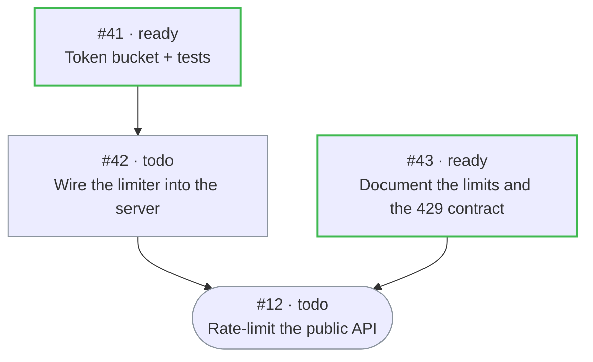

# hkb — harness kanban board

Turn a GitHub repo's issues into a kanban board that coding agents can work on their own — a portable, frugal
alternative to [Hermes kanban](https://hermes-agent.nousresearch.com/docs/user-guide/features/kanban) that needs
no server, no database and no npm dependencies.

## Quickstart

**Before you start**, three things have to be on the machine:

- **Node >= 20** and the [GitHub CLI](https://cli.github.com), `gh auth login` already done.
- **A repo you can push to** — hkb writes labels, issues and refs there.
- **A coding agent on your PATH** — [Claude Code](https://claude.com/claude-code) for the default profiles,
  or Copilot CLI / Codex with `init --harness`. hkb dispatches *to* a harness; it is not one. Without it
  `init` and `up` still succeed and cards still reach *ready*, and then nothing claims them — the dispatcher
  logs `spawn_failed` and the board looks stalled for a reason nothing on it explains. That is what step two
  is for: a board with a `claude` profile and no `claude` on PATH is a hard `✗` in `hkb doctor`, named as such.

Then two commands and a session:

```bash
npx hkb-cli init                 # labels, .kanban/board.json, the worker skill, a CLAUDE.md/AGENTS.md section
npx hkb-cli doctor --api         # once, at setup: the probe that creates and deletes one ref, proving the
                                 # issue-dependency API and lock-ref CAS actually work in *this* repo
```

Then open Claude Code in the repo and run **[`/kanban:operate`](#running-the-board-from-a-session-kanbanoperate)**
— `init` installed it. It starts the dispatcher and the web board, runs `hkb doctor`, and prints one screen: the
board's URL, what is running, what needs a decision from you, and what is worth starting. That is the loop you
stay in; every check `doctor --api` makes except the probes, it makes again every session.

Rather drive it yourself — or run the loop under systemd, cron or a terminal you watch? `npx hkb-cli up --serve`
starts both processes detached and the terminal comes back; see [Keeping the board running](#keeping-the-board-running).

That is the whole free path. `npx hkb-cli init --import` also pulls your existing open issues onto the board as
*triage*.

`init` writes **no Claude Code hooks into your settings files**. hkb's `Stop`, `PreToolUse` and
`SubagentStop` hooks serve exactly one kind of session — the worker hkb launched — so they ride that worker's launch line
(`claude --settings '{"hooks":…}'`) and nothing else in the repo ever runs them. A session you open by hand pays
nothing per tool call, and an `hkb` that stops resolving cannot fail one
([where the hooks live, and why](docs/harnesses.md#where-the-hooks-live)). `hkb init --shared-hooks` is the
opt-in for a team that *does* want them in every session in the repo.

For a repo you keep, install it there — `npm i -D hkb-cli`, then `npx hkb init`. The version is pinned in your
`package.json` and lockfile, so every machine and every teammate gets the same one from `npm install`, and it is
what makes `--shared-hooks` honest if you use it: the command it writes into the tracked `.claude/settings.json`
is `$CLAUDE_PROJECT_DIR/node_modules/hkb-cli/bin/hkb.js`, the same file in every checkout and a silent `exit 0`
in one that has not run `npm install` yet. `npm i -g hkb-cli` is the alternative — `hkb` on your PATH, which is a
fact about your machine and not about the repo, so a tracked file can then only say a bare `hkb`.

`hkb up` is idempotent: run it twice and the second run reports what is already running and starts nothing.
`hkb up --status` says what is up, `hkb down` stops it, and both processes log to `.kanban/logs/`. Want the loop
in the foreground instead — under systemd, in a container, in a terminal you watch? `hkb dispatch --loop 60` is
still exactly that. See [Keeping the board running](#keeping-the-board-running).

The labels are the only part of `init` that needs the network, so there is a way to do the rest without it:
`npx hkb-cli init --repo owner/name --no-labels` writes every local file — the skill, the board,
the `.gitignore` block, the `CLAUDE.md`/`AGENTS.md` section — and sends nothing at all, for a machine where `gh`
is not logged in yet. Run `init` again without the flag when it is; everything else is idempotent.

Now file some work and watch it get picked up:

```bash
npx hkb-cli create "Design auth schema" --agent claude --priority 2 --paths packages/db/
npx hkb-cli create "Implement auth API" --blocked-by 41    # todo until #41 is done, then ready automatically
npx hkb-cli list                                           # triage todo ready running blocked review done
```

`--priority` is a plain number and **higher wins** — the tick takes *ready* cards highest-priority first, oldest
issue first within a tie. The band, so two filers share a ruler:

| priority | meaning |
|---|---|
| `0` | unfiled (the default — no urgency claimed) |
| `1` | normal |
| `2` | next up |
| `3` | urgent |

Nothing stops a number above `3`; the band just names what most cards need. A card that outranks work it depends
on is a filing mistake, not a valid use of the scale.

### Or drive it by hand

No loop, no automation: take a card yourself and be the worker.

```bash
npx hkb-cli claim 41             # creates the lock ref, moves the card to running, prints the export line
npx hkb-cli context 41           # the brief — the same prompt the dispatcher would launch a worker with
npx hkb-cli complete 41 --summary "..."     # or block / request-review: exactly one, and the card moves
```

Hand mode and autonomous mode are the same protocol with a different dispatcher — you, or the tick. Every agent
run leaves a summary the next run reads — even when you launch the agent yourself — so a board you drove by hand
for a week is a board `hkb dispatch --loop 60` can take over mid-stream, with nothing to undo. The whole day-one
loop, and what a tick would otherwise have done for you: [Driving a board by hand](docs/manual-mode.md).

[](https://www.npmjs.com/package/hkb-cli)
[](https://github.com/emyann/harness-kanban-board/actions/workflows/test.yml)
[](https://nodejs.org)
[](LICENSE)

## How it works

- **A card is an issue.** Status, agent and board live in `kb:*` labels; the task's settings live in a
  `<!-- kb: {...} -->` block in the body. Nothing is stored outside the repo.
- **An edge is a dependency.** "Blocked by" is GitHub's own issue-dependency link, so the graph is visible in
  GitHub's UI and a task turns *ready* the moment its last blocker closes.
- **A lock is a git ref.** Claiming task #42 creates `refs/kb/locks/42/1`. Creating a ref that exists fails, so
  the claim is atomic; the heartbeat is a `--force-with-lease` push on the same ref, which costs nothing.
- **A handoff is a comment.** Each attempt ends with a structured result on the card, and the next worker —
  on that card or on one blocked by it — is handed it as part of its brief.

Because all of that is labels, dependencies, refs and comments, any harness — or a shell script — can drive the
same board. Full protocol: [skills/kanban/references/protocol.md](skills/kanban/references/protocol.md).

## Who runs a board: the seats

hkb has exactly three seats. Everything else — reviewer, profile, host, track runner, supervisor — is vocabulary,
not a role.

- **The operator is the human.** You own the repo, the token and the scope: you file and sharpen cards, steer with
  comments, review and merge, answer `kb:needs-human`, and restart a dispatcher that gave itself up. An agent
  session may drive those verbs for you — [`/kanban:operate`](#running-the-board-from-a-session-kanbanoperate) is
  its brief, and the approvals stay with you — including the approval to delegate one of them, written down.
  Delegating the click for a whole class of merges, under a stated condition, once, is still your call: it lives
  in `.kanban/board.json` as `dispatch.merge.mode: "operator"`, not in a chat transcript the next session can't
  see (see [The last step: who merges](#the-last-step-who-merges)).
- **The dispatcher is a tick, not an agent — and not an orchestrator.** `hkb dispatch` promotes what became ready,
  reclaims what died, launches what it can, and exits. It holds no workflow and has no LLM in it: the graph lives
  on the cards as issue dependencies, and the loop only reconciles labels, locks and attempts against it. That
  dumbness is the point — deterministic code, one GraphQL query per board per tick.
- **A worker is any harness.** Claude Code, Copilot CLI and Codex CLI ship as profiles; an Actions job, a shell
  script or you in your own terminal are workers too. A worker reads its brief with `hkb context <n>`, works in a
  worktree, opens a draft PR that says `Closes #42`, and ends with exactly one of `hkb finish` / `hkb block` /
  `hkb request-review`.

Which of them a machine fills is a setting, not a fork of the protocol, so adoption is a ladder rather than a
migration: cards only → the protocol by hand → explicit order → the tick → tracks and a board that runs with the
laptop closed. [Driving a board by hand](docs/manual-mode.md) is a rung, not a fallback.

## What it costs

- The board and the dispatcher cost nothing on any GitHub plan (personal or org, public or private).
- Workers bill only against the harness plan you already have. Paid profiles (Actions, Managed Agents, vendor
  cloud agents) are opt-in per board, never the default.
- The dispatcher is deterministic code, never an LLM. One GraphQL query per board per tick.
- Zero npm dependencies. Everything goes through `gh api`.

## Working the board

```bash
hkb create "Write auth tests" --blocked-by 42
hkb show 42                    # task, blockers, attempts, parent results
hkb list --status ready --json
hkb dispatch --dry-run         # what the next tick would do
hkb groom                      # the backlog lane as a proposal table — also a read, also writes nothing
```

A worker — spawned by the dispatcher, or you by hand with `hkb claim 42` and `export KB_TASK=42 KB_ATTEMPT=1` —
reads `hkb context 42`, works in a worktree, opens a draft PR that `Closes #42`, and finishes with exactly one of:

```bash
hkb finish 42 --from-stdin < /tmp/kb-42.json    # {"summary": "...", "metadata": {"changed_files": [...]}}
hkb block 42 "needs the Stripe key" --kind needs_input
hkb request-review 42 --summary "..."
```

`finish` is `complete` under a name no shell claims, and it is the name a worker should be told to type.
`complete` is a bash builtin, so a harness that vets a worker's command line word by word sees the builtin
rather than hkb's verb and refuses to run it — Claude Code does exactly that in a worktree-isolated session,
which is every `claude --bg` worker, and refuses a `<<'EOF'` heredoc there too. Redirecting a file clears both.

Every terminal verb also takes `--summary-file` / `--metadata-file` / `--reason-file`, or the inline
`--summary ".." --metadata '{..}'` flags — no harness has to push JSON through shell quoting.

Humans get `hkb promote`, `hkb unblock`, `hkb request-changes`, `hkb comment`, `hkb link/unlink`, `hkb archive`,
`hkb edit` (the `kb` block — paths, goal, priority, scheduled-at) and `hkb log`. `hkb --help` lists everything.

### The dependency graph as a diagram: `hkb graph`

`hkb graph <n>` prints the **track** rooted at `<n>` — the task plus everything still blocking it — as one
fenced mermaid block. GitHub renders mermaid in issues, comments, PRs and files, so the picture goes where the
tasks already live, with nothing to install and no page to host:

```bash
hkb graph 12                       # the fenced block, on stdout (--mermaid says the same thing louder)
hkb comment 12 "$(hkb graph 12)"   # ...posted on the goal, where the next session will find it
hkb graph 12 --json                # { root, nodes, edges, cycle, mermaid }
```



Arrows point the way work flows — blocker → what it unblocks — so the frontier is on top and the root is the
stadium at the bottom. A blocker closed as *completed* is not drawn: a track is what is **left**, and so is its
picture. One that is unfinished but not on this board is drawn dashed rather than dropped. The `classDef`s tint
borders only, so the diagram reads in GitHub's dark theme and its light one alike. `/kanban:decompose` posts it
on the goal issue as the last step of materializing a graph; the board's own drawer draws the same subgraph
live at [`hkb serve`](#the-board-in-a-browser).

### Planning the board: three slash commands

Three things a board needs are not CLI verbs, because they need a model and the dispatcher deliberately has none:

| | |
|---|---|
| `/kanban:specify <n>` | rewrites one triage one-liner into a spec a cold worker can execute — Why / What / Done when, plus `paths`, `priority` and `goal` — and promotes it |
| `/kanban:decompose <n>` | proposes the whole dependency graph for a goal (children, blockers, disjoint `paths`), and materializes it on the board once you say yes |
| `/kanban:groom` | reads the backlog lane with `hkb groom --json` and turns its findings — unblocked, thin spec, overlap, mentions — into one proposal table you approve row by row |

The CLI half of the last one is a plain read: `hkb groom` reports the lane from a single board query, the way
`hkb dispatch --dry-run` reports the next tick, and writes nothing — no status, no label, no transition. The
judgement about what to *do* with a finding is the slash command's, and yours.

All three stop and show you what they propose before writing anything. `hkb init` installs them into
`.claude/commands/kanban/`, so they work in Claude Code with nothing else installed; the plugin registers the same
three names. Their bodies delegate to the sections of the same name in
[`skills/kanban/SKILL.md`](skills/kanban/SKILL.md), so a harness without slash commands — Copilot CLI, Codex —
gets the identical procedure by asking the skill for it.

### Running the board from a session: `/kanban:operate`

The operator's seat is yours, but the loop it runs is a procedure, and a session can drive it. `/kanban:operate`
is that procedure — installed by the same `hkb init`, delegating to the same skill:

1. **Up.** `hkb up --serve`, then `hkb up --status`, then `hkb doctor` once, acting on every `✗`.
2. **Watch, never poll.** `hkb watch --json --interval 60` as the session's monitor — conditional `GET`s, so a
   quiet board is free. No `sleep`-and-`list`, and no tailing `dispatch.log` for state the board already has.
3. **React per event kind.** One row for each of the ten kinds `hkb watch` emits, and for the status, outcome and
   block kind each one landed on: what to read, which verb to run, and when the answer is "not yours".
4. **The seat boundary, in writing.** It drives verbs — `comment`, `unblock` when the answer was already on the
   board, `request-changes`, `up` after an exit 4. It never merges on a `manual` board, never edits
   `.kanban/board.json` (profiles, `allowed_tools`, models, `effort`, `merge.mode`), never re-prioritises someone else's
   queue, never clears `kb:needs-human` for any reason but an answer it has just written onto the card, and
   never starts a second dispatcher. What it cannot decide, it hands back whole: the card, what it read, what it
   would do, and whether it needs a decision, a credential or an approval.
5. **A digest per cycle** — `hkb watch`'s own one line per transition, plus what it did and what it handed back.

## The last step: who merges

**hkb never merges on its own initiative.** A finished card waits in *review* with an open PR until that PR lands,
and by default the human lands it. On a repo where you merge every agent PR a minute after it opens, that click is
a rote step; on a repo with a careful review culture it is the one gate you would never give up. That is a
difference between repos, so it is board policy — `dispatch.merge` in `.kanban/board.json`:

```jsonc
"dispatch": { "merge": { "mode": "manual" } }                  // the default — nothing changes
"dispatch": { "merge": { "mode": "operator" } }                 // hkb merge <n>, once a review is on the card
"dispatch": { "merge": { "mode": "auto", "method": "squash" } } // squash | merge | rebase
```

`operator` is for the repo in between: you have told the session running the operator seat that it can merge, but
only once it has actually reviewed the card — not blanket trust. `hkb merge <n>` is the one door that lands the PR
under this mode; it checks the condition itself rather than take a session's word for it, and refuses, naming what
is missing, when it is not met:

```jsonc
"dispatch": { "merge": { "mode": "operator", "require": { "checks": true, "review_comment": true } } } // both are the default
```

`require.review_comment` is satisfied by a `review_requested` attempt that already named a reviewer, or by
`hkb merge <n> --summary "what you checked"` — the operator session's own review, written down as the reason it
merged, not just remembered until the next restart. `require.checks` is satisfied by the PR's own checks coming
back green (turn it off on a repo with no CI to speak of). A merge under `operator` leaves one comment on the
card (`**Merged by the operator seat** — review: …, checks: …, method: …`) and the attempt that opened the PR
gets `merged_by: "operator"` in the run record — `hkb log <n>` shows it, so the delegation is visible on the card
itself, not just in whichever session's memory received it.

On `auto` the dispatcher does not merge either: it enables **GitHub's own auto-merge** on the card's PR, once, when
the card reaches review — one `enablePullRequestAutoMerge` per PR, no new query, no polling. GitHub takes it from
there and enforces its own gates: required checks, required reviews, up-to-date branches. hkb never has to answer
"is this safe to merge", which is not a question it should be in the business of answering, and the failure mode is
the quiet one — a red check or an unanswered review request just means the PR never merges. Nothing to retry,
nothing to reconcile. The **dispatcher** enables it, never the worker: merge authority is an operator concern.

That only holds if something has to go green first. **Auto-merge on an unprotected branch merges immediately** — it
would land agent-authored code the moment the PR opened, unreviewed and untested — so `hkb doctor` treats `auto`
on a base branch that requires no status check and no approving review as a **hard failure** with the fix on it,
and the tick refuses the same combination card by card rather than enabling it. Classic branch protection and
rulesets both count; a branch whose protection the token cannot read counts as no gate, because a gate that cannot
be verified is not one. The gate is checked on the branch each PR actually targets, so a track's **stacked** node
PR — based on the previous node's branch, not on the default one — is left to you unless that branch is protected
too.

One thing worth knowing before you turn it on: auto-merge waits for what the branch *requires*. `hkb request-review
<n> --reviewer alice` **requests** a review, it does not require one — if the branch only requires status checks,
the PR lands when they pass, whether or not Alice looked. Require approving reviews on the branch and the reviewer
becomes the gate that holds the merge; `hkb doctor` prints which of the two you have.

### Sending a card back: `hkb request-changes`

The other end of review. `hkb request-changes 42 "no down step in the migration"` records the note as a
`changes_requested` row and puts the card back in *ready* — and leaves the PR open, because the PR is the thing
the next attempt continues:

```bash
hkb request-changes 42 "no down step in the migration"
#42 → ready (PR #147 stays open; the next attempt continues it)
```

The next tick claims that card even though its PR is open — the `active_pr` guard, which parks every other
`ready` card with an open PR in *review*, steps aside for exactly the row `request-changes` writes. The attempt it
starts gets its checkout on **the PR's own head branch** (the dispatcher makes it, so a harness with no flag for
it works the same), and a block at the top of its brief that names the PR and says not to open a second one. It
merges the base branch in, pushes, and `hkb finish` puts the card back in *review* on the same PR — the result
comment says *continued*, not opened. One card, one PR, as many rounds of review as it takes.

Only the latest attempt row exempts a card, so a continuation that crashes goes back to *review* rather than
respawning: one `request-changes`, one relaunch, and the reviewer decides whether there is another.

### `path_overlap`: two cards, the same files

The guard exists to avoid the *merge* conflict when two open PRs touch the same files — every worker runs in its
own worktree, so it was never about two workers touching one file at once. `dispatch.guards.path_overlap` in
`.kanban/board.json` picks which cards count as "still in the way" of a candidate whose `kb.paths` overlap theirs:
`"off"` (nothing does), `"running"` (a running card does — the pre-#185 behaviour), or `"unmerged"` (a running card,
or one in *review* with a PR still open — the honest serial-landing version, since a card in review has not merged
yet). Left unset, the default follows `merge.mode`: `"off"` for `"manual"` — where a card's PR then waits on a
human, so "another card is running" stopped approximating "not merged yet" the moment a human sat between review
and merge — and `"unmerged"` for `"auto"`, where `review → merged` is immediate, so it still does. Any `merge.mode`
that is not recognized as `"auto"` — including `"operator"` (#189) — is treated the same as `"manual"` here: a human
still sits between review and merge, so the default stays `"off"` unless set explicitly. Whatever the
mode, a card never holds its paths behind an attempt whose session has gone idle without crashing — a slow human
reviewer is expected friction, a stuck agent session holding two other cards hostage is not. `hkb doctor` prints
the effective mode and why; a guard hit in `--dry-run` or the tick log names the card and paths it collided with.

```jsonc
"dispatch": { "guards": { "path_overlap": "off" } }        // never guard — the default on a manual board
"dispatch": { "guards": { "path_overlap": "unmerged" } }    // guard until the holder's PR merges — the default with merge.mode: "auto"
"dispatch": { "guards": { "path_overlap": "running" } }     // guard only while the holder is running — today's pre-#185 behaviour
```

With the guard off, conflicts are expected and cheap: every worker's finishing step merges the default branch in
before it pushes, so a PR that lands second and conflicts is one continuation attempt away from clean — the same
mechanism `hkb request-changes` already uses to send a card back.

## Keeping the board running

A board that is meant to keep moving has two long-running processes: the dispatcher loop, and — if you want it —
the web board. One command starts them, detached, and hands the terminal back.

```bash
hkb up --serve            # dispatcher + board, detached; logs in .kanban/logs/
hkb up --loop 30          # just the dispatcher, ticking every 30s (default: board.json dispatch.interval)
hkb up --status           # dispatch running pid 3843 since 19:02 · log .kanban/logs/dispatch.log
hkb down --serve          # SIGTERM to both; workers are never touched
```

Everything about it is meant to be safe to type twice. A live `.kanban/dispatch.pid` means *already running*, so a
second `hkb up` reports the pid and the start time and spawns nothing — the dispatcher's singleton lock would have
refused the rival anyway, and saying so beforehand is the difference between an idempotent command and a corpse in
the log. The child is the same hkb that ran `up` (`process.execPath` plus this package's own `bin/hkb.js`, never a
PATH lookup), so a checkout starts the checkout's dispatcher and a global install starts the global one. Its
environment carries no `KB_*`: `hkb up` may be typed inside a worker session, and a daemon that outlives that
session must not inherit its belief that it is working on task #148. Output is appended to
`.kanban/logs/dispatch.log` and `.kanban/logs/serve.log`, one `# <ISO> started pid N` header per start.

`hkb down` stops the dispatcher; `hkb down --serve` stops the board server too. Neither touches workers — a
running attempt belongs to the board, and the next dispatcher reclaims or adopts it.

`down` **waits** for what it signalled to actually be gone before it says `stopped`, and it never deletes the pid
file — each process drops its own on the way out. That file *is* the singleton lock, so removing it the instant
the signal was sent would tell the next `hkb up` that nothing is running while the old loop was still finishing a
tick: two dispatchers, one board, which is the thing the lock exists to prevent. A SIGTERM'd loop wakes out of its
wait at once, so this is usually a fraction of a second; a tick already in flight finishes first, and if the wait
runs out (two of the loop's own intervals) `down` says so, leaves the claim standing, and exits non-zero rather
than reporting a stop that did not happen.

A pid file older than the machine's last boot names a pid the kernel has since handed to somebody else. `hkb` treats
it as no claim at all — `--status` says `stopped (pid file predates this boot)`, `hkb up` replaces it, and `hkb down`
never signals it.

**`hkb up` is not a supervisor,** and will not pretend to be one: it never restarts anything. Exit code 4 is the
dispatcher loop deliberately giving itself up for a supervisor to restart (cron, systemd, Actions, or you), and
that is still what it means — `hkb up --status` reports `dispatch exited (4) at 19:02 — hkb up restarts it` so an
operator, or an agent session, can see it in one call. `hkb doctor` says the same thing in one line. If you want
the loop in the foreground under a real supervisor, `hkb dispatch --loop 60` is unchanged.

On Windows, `detached` + `unref` is the whole detach story for this first cut and `down` is a plain
`process.kill(pid)`; treat `hkb up --status` as the source of truth for what is actually running.

## The board in a browser

```bash
hkb serve                                  # http://127.0.0.1:4666
hkb serve --repos ../api,../infra#release  # several checkouts, one server, one port, one tab
```

`hkb serve` is a zero-dependency http server and one inline page — no build step, no second source of truth.
It reads the live board with the same `fetchBoard` query (one GraphQL call per board per poll, shared by every
tab, ETag so an unchanged board costs nothing), and drag-drop between columns runs the same verbs the CLI does:
only the legal moves, and an illegal one is refused with the reason. Cards show agent, priority, blockers and
the PR; the drawer shows the description, the `kb` block, every attempt, the latest result and the worker's log
tail. There is no auth — it binds `127.0.0.1`, refuses cross-origin calls, and warns loudly if you pass `--host`.

**More than one repo.** A second repository does not cost a second server, a second port and a second tab.
`--repos <path,path>` adds those checkouts to the one you ran in; `#slug` after a path picks a board inside it.
The seven columns stay, boards become chips in a bar under the header — each with its own dispatcher dot and
count, click one to narrow the page to it — and every card carries the repo it belongs to, because `#12` on two
boards is two different tasks. Each board keeps its own everything: its own poll query, its own dispatcher
state, its own worker logs, and its own verbs — a card can only ever act on the repo it came from. One board
that fails to read (expired auth, no network) says so in a strip and keeps its last good cards; the others
carry on. `gh` auth is already global, so one token reads them all.

A set of repos you always want together goes in a user-level list instead of a flag — it spans repos, so it
cannot live in any one `.kanban/`. `hkb serve` with no flag reads `~/.config/hkb/boards.json`
(`$XDG_CONFIG_HOME`/`$KB_CONFIG_HOME` if set) and shows those boards alongside the current one. You do not
have to write that file: `hkb init` puts the checkout it just set up on the list, so the repos you have
`init`ed are the repos the page shows, and the common case needs no config at all. Init prints the file it
wrote — `registered this checkout in ~/.config/hkb/boards.json — hkb serve will show it`, or
`already listed in ~/.config/hkb/boards.json — hkb serve will show it` the second time — because that file is
the one thing `init` writes outside your repo, and you should hear about it rather than find it. A checkout you
set up before any of this existed is one command away: `hkb init` only ever adds, so running it again in a repo
that is already set up changes nothing but the list — and says so.

The list is still yours, and still a plain file to edit:

```json
{ "version": 1, "boards": ["~/code/web", "~/code/api", { "path": "~/code/infra", "board": "release" }] }
```

A bare path is what `init` writes and what you write by hand; the checkout's own `.kanban/board.json` names
the board, so a rename follows it. `{ "path": ..., "board": ... }` — or `"~/code/infra#release"` — pins a
second board inside one repo, which is the thing `init` cannot work out for you. Delete an entry to stop
serving it.

The list is live: `hkb serve` re-reads it once per poll interval, so a board you add to it — or a checkout
you just `hkb init`ed in another terminal — appears on the open page without a restart, and one you drop
stops being served. The re-read is a local file and costs no GitHub call, and a board that was already there
keeps its cached cards. An entry that no longer exists is a warning and a skip, never a broken `hkb serve`.
`--repos` is the set you typed for that run: it overrides the list, and does not reload.

Nothing is scanned for: hkb never crawls your filesystem looking for repos, and a checkout that registers
itself is not an exception — running `hkb init` in a directory *is* the act of naming it. The page shows the
checkouts you set up and the ones you wrote down, and nothing else.

## The board as a stream

```bash
hkb watch                                   # one line per board transition, until Ctrl-C
hkb watch --kinds completed,blocked --json  # only those, as JSONL, for a script to consume
hkb tail 42                                 # follow one task's status, attempts and comments
```

Each poll is a conditional `GET`: hkb sends back the `ETag` of the last representation as `If-None-Match`, and
GitHub answers `304 Not Modified` with an empty body — which costs nothing against the rate limit, so watching a
quiet board all day is free. Only a `200` is diffed against the previous snapshot, and only a difference prints.
`--kinds` takes event kinds (`status`, `attempt`, `outcome`, `result`, `comment`, …) or the status/outcome an
event landed on, so `--kinds completed` reads the way you'd guess. `GHK_DEBUG=1` shows every poll with its status
and the rate-limit counter:

```
hkb watch: board: GET repos/o/r/issues?labels=kb%3Aboard%3Adefault&... → 304 Not Modified · rate 219 (+0) · etag 594b2e9a588b
```

## What it ran, and what it spent

```bash
hkb stats                       # the last 7 days: what ran, how it ended, what it cost
hkb stats --since 24h --json    # the same object, for a script or a dashboard
hkb stats --since all           # every attempt the board has ever recorded
```

`hkb stats` is the board's own ledger, so a paid profile is never a surprise:

```
board "default" · acme/board · window 7d (since 2026-08-19T23:20:45Z)

tasks      21 (5 open) · 12 with news in the window
           ready 3 · running 2 · done 16
attempts   35 over 20 tasks · 33 ended · 2 active
           completed 13 · crashed 2 · timed_out 3 · spawn_failed 2 · protocol_violation 10 · gave_up 3
           delivered 13 (39%) · blocked 0 · failed 20
duration   mean 1h18m · median 10m11s · p90 1h20m · max 15h07m  (29 ended)
spawns     30 / 40 today · 10 left
spend      $9.02 reported · on 3 of 29 worker attempts
           claude-p        $9.02 · 3 attempts · mean $3.01 · max $5.14 · 120 turns
           ~$34.59 estimated on top, for 20 worker attempts priced from their transcripts — an estimate, not a reported cost
           6 worker attempts priced nothing at all — the real total is higher
usage      1840 turns · in 42k · out 310k · cache 1.2M written / 38M read  (20 transcripts)

read 1 board query + 21 run records; nothing was written.
```

It invents no new state: statuses come from the labels, attempts and outcomes from the `<!-- kb-run -->`
comments, today's spawn count from the dispatcher's `.kanban/state.json`, and spend from whatever the attempt
actually left behind — `total_cost_usd` on the row or at the end of the worker's log (what
`claude -p --output-format json` signs off with), and failing that the tokens in the session transcript, read
from disk on the host that ran it. That last one is why a background agent, which signs off with no JSON at all,
still has a number: its terminal verb records the session it ran in, and the dispatcher records it for the
attempts that never file one
([how](docs/harnesses.md#how-a-background-worker-records-a-session-nobody-told-it-about)) — `hkb doctor` warns
when a background profile has recorded none at all, which is the one way this can be empty and stay quiet.
The three are never mixed. A reported cost is money; the transcript priced
at the board's rates is written `~$…` and called an estimate; tokens with no rates are printed as turns and
tokens, which beat nothing. Rates are yours to state, because hkb ships no price table it would have to keep
current:

```jsonc
"stats": { "rates": { "claude-opus-5": { "input": 5, "output": 25 } } }   // .kanban/board.json, USD per Mtok
```

Which of the three you get is decided by the profile, not by hkb —
[the per-profile table](docs/harnesses.md#what-a-profile-can-tell-you-it-spent) is worth reading before you pick
one. `--since` takes a span (`90m`, `36h`, `7d`, `2w`), a date, or `all`. The read is one board query plus the
run comment of each task the window actually touched — a comment write bumps the issue's `updatedAt`, so
"updated since" is "has news" — plus every `running` task, whose ref-CAS heartbeat leaves no trace on the issue.

## Harnesses

`.kanban/board.json` declares profiles: a launch template plus caps. The built-in `claude` profile starts each
worker as a Claude Code **background agent** — `claude --bg --name "kb #<n> · <title>" --worktree kb-<n>-<k>
--permission-mode dontAsk --allowedTools ... --max-budget-usd 5 "<prompt>"` — so workers show up in
`claude agents` (and the agents view of any session in the repo), can be opened with `claude attach <job>`, and are
stopped by the dispatcher once their attempt has ended. `hkb show <n>` prints the job id per attempt.
`claude-p` is the headless variant (`claude -p`, exits when done) for CI and containers without the session daemon.

They do not all tell you what they spent, and that is worth knowing at the point of choice: `claude-p` ends in
Claude's own JSON, so `hkb stats` shows a **reported cost**; `claude` and `claude-track` are background agents
that report none, so the most they leave is the session transcript — **tokens**, and a dollar figure only if you
give the board `stats.rates`; `copilot-cli`, `codex` and `claude-action` leave neither, so an attempt there is an
outcome and a duration.
Profile by profile: [docs/harnesses.md](docs/harnesses.md#what-a-profile-can-tell-you-it-spent).

A board carries **only the profiles you asked for**: a bare `hkb init` writes `claude` and its one `kb:agent:claude`
label, and nothing else. `--profiles a,b` (or `--harness copilot|codex`, which brings its own) is the whole list —
so a Claude-only repo never grows labels for harnesses it will not install, and `hkb doctor` has nothing to warn
about. Re-running init only *adds*: `hkb init --profiles claude-track` puts that profile on an existing board and
leaves everything already there — including profiles you wrote by hand — untouched.

`claude-track` is the same launcher pointed at a whole **track** — a root task plus everything still blocking it,
usually what `/kanban:decompose` just materialized. One session **orchestrates** the subgraph instead of one cold
session per node: it walks the graph in waves of mutually-independent nodes, hands each node in a wave to its own
isolated subagent (`Agent` with `isolation: "worktree"`, allow-listed on this profile and no other), and starts the
next wave once they have all recorded a verb. So siblings run at the same time and a dependent pair costs no tick of
latency and no re-derived context, while the board is unchanged: every node is still claimed, worked in its own
worktree, and finished with its own terminal verb and its own PR. Every node stays a durable checkpoint, so a track
runner that dies leaves a board the ordinary dispatcher finishes node by node — and a root that has had one track
attempt is never handed to a second track runner. Nothing has to be turned on: a root with unfinished children is
dispatched as a track by default, and `hkb track <root>` says so and why (`hkb track <root> --off` runs its children
as cold nodes instead; `hkb adopt <root> --agent claude-track` forces one). Give the root a `max_runtime` and a
budget for the whole track.
A track costs one `max_in_progress` slot however many nodes it holds — which makes it the only way to run a wave
wider than the board's slot count — and per-node `kb.paths`, disjoint by construction, are what keep a wave from
fighting over files. Cross-harness tracks are out of scope: a node on a profile outside the track runner's
`track_agents` simply makes the track un-claimable and the board falls back to node dispatch. See
[Tracks](skills/kanban/references/protocol.md#tracks--the-second-execution-engine).

`copilot-cli` is the same deal for **GitHub Copilot CLI**, which is included in Copilot Free:

```bash
hkb init --harness copilot     # adds the profile and generates the two files Copilot needs
hkb doctor                     # checks `copilot` is on PATH and the generated files are there
```

`--harness copilot` writes `.github/agents/kanban-worker.agent.md` (the custom agent the profile selects with
`copilot --agent kanban-worker`; its body is spliced out of `skills/kanban/SKILL.md`, so the protocol text lives in
one place) and `.github/hooks/kanban.json` (an `agentStop` hook running `hkb hook stop` — the same two-nudge
enforcement Claude Code gets from its `Stop` hook). Both are generated: re-running init overwrites them.
Copilot CLI has no worktree flag, so the profile carries `workspace: "worktree"` and the dispatcher runs
`git worktree add .claude/worktrees/kb-<n>-<k> -b kb-<n>-<k>` itself before launching the worker there.
Compared with the Claude profiles you lose structured JSON output — everything hkb records about an attempt comes
from the `hkb` commands the worker runs — and `max_in_progress` defaults to 1, because Copilot Free's credit pool
is small.

`codex` is the third local harness, **OpenAI Codex CLI**:

```bash
hkb init --harness codex       # adds the profile, .codex/hooks.json and the setup notes
hkb doctor                     # codex on PATH · the generated files · the schema the launch names
```

Each attempt runs `codex exec -C <worktree> --sandbox workspace-write --output-schema
.agents/skills/kanban/schema/terminal.json "<prompt>"` in a worktree the dispatcher created, so the sandbox — not
an allowlist — is the permission policy, and the final message mirrors the terminal verb into
[`terminal.json`](skills/kanban/schema/terminal.json). Codex will not run project hooks until you trust the
project once (`/hooks`, or `trust_level = "trusted"`), and its `workspace-write` sandbox needs network access
before a worker can push: both steps are written into `.codex/README.md` with your paths filled in.

Any other harness plugs in the same way — a `launch` array in `.kanban/board.json`; the protocol does not change.
Details, flags and troubleshooting for all of them: [docs/harnesses.md](docs/harnesses.md).

## Runs when the laptop is closed

The dispatcher is one command, so it also runs in GitHub Actions. `hkb init --with-actions` generates the two
workflows that do it — nothing else about the board changes:

```bash
hkb init --with-actions        # .github/workflows/kanban-dispatch.yml + kanban-worker-claude.yml
gh secret set KB_TOKEN         # fine-grained PAT, this repo: Issues, Contents, Pull requests, Actions RW
claude setup-token && gh secret set CLAUDE_CODE_OAUTH_TOKEN     # or: gh secret set ANTHROPIC_API_KEY
git add .github/workflows && git commit -m "kanban: dispatch from Actions" && git push
```

That last line is not a formality: Actions only ever runs the copy of a workflow that is on the **default
branch**. No secret is ever written into a template — both files reference `${{ secrets.* }}` and nothing else,
and until `KB_TOKEN` exists the dispatcher prints a `::notice::` saying so and dispatches nothing.

**`kanban-dispatch.yml`** is `hkb dispatch --max 1`, triggered by what actually changes the board —
`issues: [closed, reopened, labeled, unlabeled]`, `pull_request: [closed]`, `pull_request_review`,
`workflow_run` (a worker finishing), `workflow_dispatch` — with `schedule: */15` as a **sweeper only**, for the
things no event announces: a worker that died, a `scheduled_at` that came due. `concurrency: kb-dispatch-<board>`
with `cancel-in-progress: false` keeps it to one tick at a time, because a cancelled tick can leave a claimed
lock ref with no worker behind it. It passes `--profiles claude-action`, so an Actions runner claims only the profile
it can actually launch and leaves your laptop's `claude` tasks alone; reclaim, promote and reconcile still cover the
whole board on every tick.

**`kanban-worker-claude.yml`** is one attempt on one task. The `claude-action` profile's launch does not start a
worker locally — it is `gh workflow run kanban-worker-claude.yml -f task=<n> -f attempt=<k>` and exits, so the
attempt is recorded as `remote`: no pid, no background job, and its heartbeat (the same CAS on
`refs/kb/locks/<n>/<k>`) plus `max_runtime` are the whole liveness check. On the Actions runner, a step turns
`hkb context <n>` into the prompt for [`anthropics/claude-code-action@v1`](https://github.com/anthropics/claude-code-action)
— the same brief a local worker is launched with, the same allowlist, the same `Closes #<n>` draft PR, the same
terminal verb. There is no `Stop` hook on an Actions runner, so a final `if: always()` step ends an attempt that finished
without one (`hkb block … --kind transient`) instead of leaving it `running` until the stale reclaim.

**The honest latency.** The 60-second cadence exists only while your laptop loop runs. Actions' cron floor
is 5 minutes, top-of-hour schedules are routinely 15-20+ minutes late, and scheduled workflows are dropped
entirely on a public repo with no activity for 60 days — which is exactly why the cron here is a sweeper and the
events are the real trigger. **Laptop-off latency is 15-75 minutes**, end to end. If you want 60 seconds, run
`hkb up` on a machine that stays on; the two dispatchers are safe to run together, because the lock ref is the
arbiter.

What you give up, plainly: Actions minutes (free on public repos; a platform fee per minute on private ones —
the board itself stays free), no enforced `Stop` nudge, no spend on the board for those attempts (the log and the
transcript stay on the runner, so `hkb stats` counts them and prices none of them), a per-task `model` override that is not plumbed through
workflow inputs yet, and a worker whose run is cancelled or killed is only noticed at `stale_after`, not at
`workflow_run`. Details and the whole table: [docs/harnesses.md](docs/harnesses.md#github-actions--claude-action).

## MCP (optional — the CLI is the protocol)

Harnesses that prefer tools to a shell get the same verbs over MCP:

```bash
hkb init --mcp   # writes .mcp.json, prints the Codex and VS Code equivalents
hkb mcp          # the server itself: JSON-RPC 2.0 on stdio, no dependency
```

`.mcp.json` is read verbatim by Claude Code and Copilot CLI:

```json
{"mcpServers": {"kanban": {"type": "stdio", "command": "hkb", "args": ["mcp"]}}}
```

Codex reads MCP servers from `~/.codex/config.toml` and VS Code from `.vscode/mcp.json` — neither is hkb's file
to write, so `--mcp` prints those two snippets instead of generating them.

The nine tools are the nine verbs — `kanban_show`, `kanban_heartbeat`, `kanban_complete`, `kanban_block`,
`kanban_request_review`, `kanban_comment`, `kanban_create`, `kanban_link`, `kanban_unblock` — and each one calls
the function the CLI calls and returns the object its `--json` prints. There is no second code path: a
`tools/call` of `kanban_show` is byte-for-byte `hkb show <n> --json`. `task` defaults to `$KB_TASK`, so a worker
just calls `kanban_show`. Nothing about the board requires MCP; it is a second doorway to one protocol.

## GitHub Projects mirror (opt-in, off by default)

If you live in GitHub's own Projects UI, link a Projects v2 board and the dispatcher will mirror the board onto it:

```bash
gh auth refresh -s project      # Projects v2 needs its own scope
hkb init --project new          # or: --project 7 / --project https://github.com/users/me/projects/7
```

`init` links (or creates) the project, makes sure its single-select **Status** field has an option per kb status —
appending only, so columns you already made are kept, and `Todo` / `In Progress` / `Done` are reused as
`todo` / `running` / `done` — and stores the ids in `.kanban/board.json` under `"project"`. Delete that key to turn the
mirror off; `hkb doctor` reports the scope and whether the project is still there.

**Strictly one-way.** Labels are canonical and the Project is a read surface: dragging a card changes nothing on the
board, and the next tick puts it back where the label says. Only the dispatcher writes, so a transition a worker makes
(`hkb complete` → *review*) appears on the next tick, not instantly.

**What it costs**, on top of the free path, and only while it is on: one GraphQL read of the project's items per tick,
one mutation per status transition, and two the first time an issue is added to the project (`hkb dispatch --dry-run`
prints the moves it would make). Deleting the Project, or losing the scope, costs the mirror and nothing else — the
tick logs the fix once an hour and carries on.

## Staying current

hkb has no push channel and does not want one — it is a CLI over `gh`, with no service and nothing that phones
home — so updates are pull-only, and something has to say there is something to pull. Two places do, from one
`GET https://registry.npmjs.org/hkb-cli` a day:

```
✓ hkb version                          0.1.4 (latest)
! hkb version                          0.1.4 installed, npm has 0.2.0  → npm i -g hkb-cli@latest && hkb init
```

`hkb doctor` prints the line every run. The dispatcher loop logs it on the first tick of a day it is behind, and
on no other tick — a loop that has been up for weeks is the install most likely to be stale, and its operator is
not running doctor. Nothing else asks: `hkb list` waits on npm for nothing.

Both commands matter. A stale CLI ships a stale *packaged* skill, so doctor compares two copies that agree and
reports `✓ skill` on a board months behind: `npm i -g hkb-cli@latest` replaces the CLI, and `hkb init` re-copies
the skill it brought. There is deliberately no `hkb update` — hkb cannot know whether it was installed globally,
through `npx`, or from a checkout, and a package manager rewriting the directory the running process lives in is
not something to guess at.

An unreachable registry is not a failure: no notice, no error, nothing stamped, and the next run asks again — an
air-gapped machine behaves exactly as it did before the check existed. Running an old version on purpose is a
choice rather than a mistake, so `"version_check": false` in `.kanban/board.json` turns the daily ask off, and
doctor then names the installed version once with nothing to do about it.

## How it maps to GitHub

| Hermes | hkb |
|---|---|
| SQLite row | Issue with `kb:status:*`, `kb:agent:*`, `kb:board:*` labels and a `<!-- kb: {...} -->` body block |
| parent → child | child **blocked by** parent (native issue dependencies) |
| `todo → ready` when all parents done | dispatcher tick, from `blockedBy { state stateReason }` |
| atomic claim | `POST git/refs refs/kb/locks/<n>/<attempt>` — 201 claimed; 422 "Reference already exists" (observed) or 409 held; anything else back off |
| heartbeat | CAS on the same ref: `git push <empty commit>:<ref> --force-with-lease=<ref>:<expected>` — free, and a rejected lease is `LOCK_LOST` (exit 3). Profiles that cannot push refs use `"heartbeat": "comment"` |
| runs table | one `<!-- kb-run -->` comment (attempts, failures, block loops) |
| `kanban_complete(summary, metadata)` | `<!-- kb-result -->` comment; open PR → *review*, else issue closed |
| worker tools | `hkb show/heartbeat/complete/block/request-review/comment/create/link`, or the same nine as MCP tools (`hkb mcp`) |
| stop nudge | Claude Code / Codex `Stop`, Copilot CLI `agentStop` hook (`hkb hook stop`, 2 nudges, inert unless the session is a worker's — `KB_TASK`, or the `kb-<n>-<k>` checkout it runs in, which is all a background agent has). Claude Code's pair rides the **worker launch** as `--settings '{"hooks":…}'`, so no other session in the repo runs them and the command may name whichever `hkb` *this* machine has; `hkb init --shared-hooks` puts them in the tracked `.claude/settings.json` instead, for a team that wants them in every session, where the command is a plain `hkb` every teammate needs on PATH (`hkb doctor` says so when it is not there) |
| worker permissions | **the launch line**, on every profile: `--permission-mode dontAsk` (deny, never a prompt — nobody is there to answer one) with an `--allowedTools` list covering the shell builtins hkb's own guard calls safe, and `--disallowedTools "Bash(hkb dispatch*),Bash(git push --force*),Bash(git push -f*)"`. On top of it, where it runs, the Claude Code `PreToolUse` hook (`hkb hook pretool`, inert unless `KB_TASK` is set — so **not** on the `claude --bg` profiles): it may **deny or say nothing, never allow**, so it can only subtract from the launch's list — `kill`/`sudo`/`rm -rf <abs>` and file tools outside the worktree on top of the profile's allowlist. A denial tells the worker to `hkb block <n> "needs …" --kind capability` rather than work around it. `hkb doctor` prints which layer enforces on each profile, warns about a frozen allow-list or a launch that lost `dontAsk`, and [docs/harnesses.md](docs/harnesses.md#which-layer-is-actually-enforcing) has the table. The launch carries this hook beside the Stop hook |
| kanban dashboard | `hkb serve` — local page over the live board; drag-drop calls the same verbs |
| live event stream | `hkb watch` / `hkb tail <n>` — conditional `GET` with `If-None-Match`; an unchanged board answers 304 and is not charged |
| runs/spend report | `hkb stats` — the same labels and run comments, rolled up: outcomes, duration, spawns vs the daily cap, and spend per profile — `total_cost_usd` where the harness reported one, else the session transcript's tokens, priced at the board's `stats.rates` and labelled an estimate ([what each profile gives you](docs/harnesses.md#what-a-profile-can-tell-you-it-spent)) |
| crash / stale / timeout | pid check on the claiming host, `stale_after` (against the lock ref's commit date, then the run comment), `max_runtime` → `ready` or `gave_up` |

## Local state (gitignored)

`.kanban/logs/` worker logs · `.kanban/state.json` spawn counters, auth pauses and the day stamps that keep the
token-expiry and version checks to one probe a day · `.kanban/outbox.jsonl` writes queued while GitHub was unreachable (replayed on the next tick) · `.kanban/cache.json` GraphQL capability cache · `.kanban/dispatch.pid` the loop's singleton lock and `.kanban/serve.pid` the board server's, both [what `hkb up`/`hkb down` read](#keeping-the-board-running) · `.kanban/nudges/` and `.kanban/sessions/` stop-hook bookkeeping · `.claude/settings.local.json` is still ignored, because an older `hkb init` put the two hooks there and the next one takes them back out.

`hkb init` adds all of them to `.gitignore`, one line at a time — your own entries are left alone. `.kanban/board.json` is the exception: it is the board's configuration and belongs in the repo.

One file lives outside it. `~/.config/hkb/boards.json` (`$XDG_CONFIG_HOME`/`$KB_CONFIG_HOME` if set) is the user-level list of checkouts [`hkb serve` shows together](#the-board-in-a-browser); `hkb init` adds this checkout to it and prints that it did, because it is the only thing hkb writes outside the repo you ran it in. Deleting it costs nothing but the multi-repo page.

## Docs

- [The protocol](skills/kanban/references/protocol.md) — statuses, claims, attempts, handoff; what a worker must do.
- [Driving a board by hand](docs/manual-mode.md) — the day-one loop with no dispatcher: claim, context, one
  terminal verb, the heartbeat contract, and moving an existing roadmap onto the board.
- [Harnesses](docs/harnesses.md) — per-harness setup, profiles, generated files, Codex's one-time trust, Actions.
- [Releasing](docs/releasing.md) — how a version gets to npm: one tag, provenance, and a clean-room `npx` check.
- [Project status and verified behaviour](docs/status.md) — how far along this is, and the GitHub API facts the
  design leans on, each with the probe that confirmed it.
- [Design rationale](docs/EVALUATION.md) — judged alternatives and the roadmap.

Requires Node >= 20 and the [GitHub CLI](https://cli.github.com), authenticated. MIT licensed.
