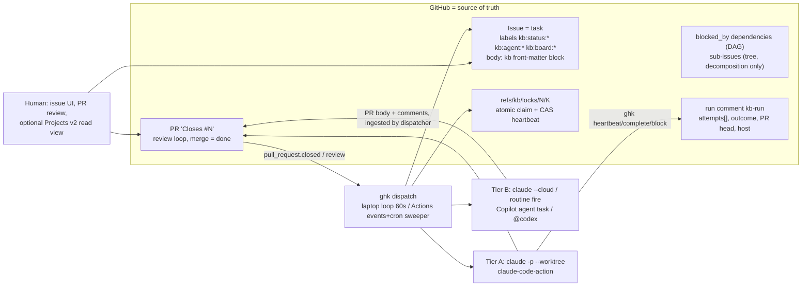

# GitHub-native kanban for Claude Code (and Copilot/Codex): final report

## 1. TL;DR

- **Yes, GitHub as the backend is the right call** — for this user, this repo, and the multi-surface goal. The backlog already lives in 38 issues; Issues + labels + native `blocked_by` dependencies work on every plan; humans get the UI and audit trail for free; and a laptop loop, an Actions job, a claude.ai/code session, a Copilot task and a person on github.com can all write to the same state. Every local-first alternative (SQLite like Hermes, Dolt like Beads, an orphan git branch like the "Tackboard" design) either cuts cloud workers out of the protocol or needs a mirror that lies between ticks.
- **GitHub gives you exactly one atomic primitive: git ref create/CAS.** Labels, assignees, comments and Project fields are last-writer-wins. So the claim lives in a ref, status lives in labels, and the dispatcher is stateless and idempotent. Two refuter-verified fixes: treat `409` as "held" but `422/403/5xx` as "back off, unknown" (never "all tasks claimed"), and keep the lock ref **separate** from the code branch.
- **There is no better backend, but the leading design needed surgery.** The recommended architecture below is `github-native` (winner, 23/30) with grafts: Tackboard's `--force-with-lease` CAS heartbeats and `LOCK_LOST` signal, the hybrid's MCP-as-CLI-wrapper and zero-install skills-dir plugin, and all held refuter changes (event-driven Actions, heartbeat budget, honest per-profile tiering, plugin packaging split, `promote_on: pr_open` removed).
- **Stacked PRs are not relevant to the board.** They are a linear, same-repo review/merge primitive; the board's graph is a DAG on issues. Cascading server-side rebases rewrite branches, multiply CI cost on pipao-v2's PR workflows, and cannot be driven from Copilot cloud, Codex cloud or Claude cloud. The single case where they help is a serial, single-worker, human-reviewed layer chain; implement it (if ever) as a dispatcher-side post-hoc registration, not as a board mode.
- **It costs nothing beyond the harness you already run.** The board (Issues, labels, `blocked_by`, refs, comments) and the dispatcher (a laptop loop, or Actions' included minutes) are free on every GitHub plan, personal or org. Paying is a per-profile choice made for a reason — laptop-off execution (Actions minutes, Managed Agents) or a vendor's cloud agent — never a prerequisite.
- **Portability is real, and the free path is the strong path.** Tier A (full Hermes parity: enforced terminal verb, worktree, structured output, kill-on-reclaim) is the *local* harness on all three vendors — Claude Code, Copilot CLI (included in Copilot Free), Codex CLI — plus claude-code-action. Tier B (claim/ready/handoff via issues, terminal state ingested from PR/comments, no enforced nudge) is the vendor clouds: Copilot cloud agent, Claude cloud/routines, Codex cloud. Tier C (schema only): anything else with `gh`.
- **The 60-second Hermes cadence exists only while your WSL2 loop runs.** Actions is a sweeper (5-min cron floor, top-of-hour delays of 15-20+ min reported, $0.002/min platform fee); its primary triggers must be events (`issues.closed`, `pull_request.closed`, `workflow_run`), not cron. Honest laptop-off latency: 15-75 min.
- **Build first (a weekend):** `ghk` CLI (labels + `blocked_by` + lock ref + run comment), `recompute_ready`, a 60-s laptop dispatcher spawning `claude -p --worktree`, a spec-only SKILL.md in `.agents/skills` symlinked into `.claude/skills`, and a Stop hook. No Projects, no MCP, no Actions, no stacks yet.

## 2. Recommended architecture: `ghkanban` (CLI `ghk`)

### Values this design is held to

- **Portable** — a real alternative to Hermes kanban, not a Claude feature. The protocol is labels, dependencies, refs and comments that any harness can drive through `gh`; harness-specific glue (hooks, agents, MCP config) is generated from one source and is never required for the board to work.
- **Frugal** — the board and the dispatcher cost nothing on any GitHub plan. The dispatcher is deterministic code, never an LLM. Workers default to cheap models and the frontier model is reserved for decompose/specify (Hermes' cost strategy). Every spend has a cap: `--max-budget-usd`, `--max-turns`, `max_retries`, a per-board daily spawn cap.
- **Performance** — one GraphQL query per board per tick, conditional GETs (304s are free), heartbeats as ref CAS (no REST content writes), event-driven Actions instead of cron, `active_pr` and path-overlap guards so no worker is spawned to redo or collide with work in flight. The laptop loop keeps Hermes' 60-second cadence.
- **Flawless experience** — two commands to install on the free path, `ghk doctor` before the first dispatch, the same verbs in CLI, MCP and slash commands, and no silent failures: every attempt is a run-comment row, every stuck task ends in `kb:needs-human`, every rate-limit or outage is a logged pause, never a lost result.
- **Money, only where it earns its place** — pay for what the free path cannot give: work continuing with the laptop closed (Actions minutes, Managed Agents), a real sandbox with a judged goal loop (Managed Agents `define_outcome`), or a vendor cloud agent you already have. Paid profiles are opt-in per board and are never the default.

### Principle

"The tracker is the state machine; the dispatcher is stateless; claims live in the shared backend." Everything that must survive a crash lives in GitHub. The only non-GitHub state is a worktree on the host that claimed the task, plus an outbound write queue for outages.



### Data model (issue = task)

- **Machine fields**: an HTML comment block at the top of the body, edited only by `ghk`:
  `<!-- kb: {"v":1,"board":"default","priority":2,"workspace":"worktree","max_runtime":3600,"max_retries":3,"model":null,"skills":["md3-spec"],"goal":"...","scheduled_at":null,"idempotency_key":"...","paths":["packages/md3/**"]} -->`
  Malformed block degrades to defaults; never crashes the dispatcher. On the org (Team plan, issue fields GA 2026-07-02) the same keys may be mirrored to org issue fields for filtering; the body block stays canonical so personal repos behave identically.
- **Counters that drive safety** (`failures`, `block_loops`, `attempts`) live in the **run comment**, not the body block, because humans edit bodies.
- **Status**: exactly one `kb:status:<triage|todo|ready|running|blocked|review|done|archived>` label; `done` = closed as completed; `archived` = closed + label. `kb:needs-human` is an orthogonal flag.
- **Profile**: `kb:agent:<claude|claude-action|claude-cloud|copilot|codex|human>`. Real GitHub assignee only when the harness needs it (`copilot-swe-agent[bot]`, human reviewers).
- **Graph**: native issue dependencies (`POST /repos/{o}/{r}/issues/{n}/dependencies/blocked_by {issue_id}`, header `X-GitHub-Api-Version: 2026-03-10` pinned on every call; 50 per direction). Hermes parent->child == child `blocked_by` parent. Sub-issues (100/parent, 8 deep) are added for the decomposition tree in the UI but **never** used for sequencing. `ghk link` refuses cross-board links.
- **Run record** (Hermes `runs` table): one pinned `<!-- kb-run -->` comment per issue with a fenced JSON `attempts[]` `{attempt, profile, host, pid|session|run_id|task_id, pr_head, started, heartbeat, outcome, exit_code, summary, reason}` plus rendered summary. Outcome enum kept verbatim: `completed|blocked|crashed|timed_out|spawn_failed|reclaimed|protocol_violation|gave_up|review_requested|changes_requested`.
- **Result / handoff**: `<!-- kb-result -->` comment with `summary`, `metadata{changed_files, verification, dependencies, blocked_reason, retry_notes, residual_risk}`, `artifacts[]`. `ghk show` walks `blockedBy` and renders `## Parent task results` exactly like `kanban_show`.
- **Events**: the immutable issue timeline (`labeled`, `closed`, `cross-referenced`...) rendered by `ghk log`; transitions the timeline can't express (`heartbeat`, `stale`, `reclaimed`, `gave_up`, `respawn_guarded`, `protocol_violation`) are rows in the run comment.
- **Precedence on conflict**: run comment > labels > body block. `ghk doctor` repairs labels from the run comment each tick.

### Lock and heartbeat (the part that must be right)

- **Claim** = `POST /repos/{o}/{r}/git/refs {ref:"refs/kb/locks/<n>/<k>", sha:<base sha>}`. `201` = claimed. `409` = held by someone else, skip. `422`/`403`/`5xx` = unknown (rate limit, outage): log, back off with jitter, **do not** treat as held. Docs list 201/409/422 (docs.github.com/en/rest/git/refs); the 422 text explicitly includes "the endpoint has been spammed".
- **Lock ref != code branch.** The worker's output branch is whatever the harness produces (`kb/<n>-<slug>` locally, `claude/*` for cloud/routines, Copilot's own branch off `base_ref`); the run comment records `pr_head`. This is the refuter fix: cascading rebases, retargets and harness branch policies can never be misread as lost locks.
- **Heartbeat** (Tier A workers) = `git push origin <new-sha>:refs/kb/locks/<n>/<k> --force-with-lease=refs/kb/locks/<n>/<k>:<prev-sha>` — a true CAS, zero REST content-creation cost. A rejected lease means `LOCK_LOST`; the skill says "stop immediately, do not commit, do not call complete". Tier B workers (cloud, no push to arbitrary refs) heartbeat by editing the run comment, floored at 20 min, and the dispatcher owns their lock.
- **Attempt id in the ref** means a zombie's `ghk complete` for attempt k is refused after the dispatcher moved to k+1.
- **Orphan lock sweep**: a lock ref older than 10 min with no matching attempt in the run comment is deleted (covers a dispatcher crash between ref create and label write).

### State machine

```
triage --(human / ghk promote / decompose)--> todo
todo   --(recompute_ready: ALL blocked_by closed-as-completed AND scheduled_at <= now)--> ready
ready  --(claim)--> running
running --complete--> done (closed)  |  --block(kind)--> blocked  |  --request-review--> review
running --crash/timeout/reclaim--> ready (failures++)  ; failures >= max_retries --> blocked{gave_up} + kb:needs-human
review --PR merged / reviewer complete--> done  |  --CHANGES_REQUESTED / request-changes--> ready (same branch, resume session)
blocked --unblock / dependency closed / transient backoff--> ready
same block reason x3 --> triage + kb:needs-human
done --archive/gc--> archived
```
`ready` derives **only** from blocker closure (Hermes semantics). PR mergedness never gates readiness. GitHub does none of this itself (verified: built-in Project automations cover closed/merged only), so the dispatcher computes it every tick from `blockedBy(first:50){state stateReason}` on the issue — never from `/search/issues`, which is eventually consistent and capped at 30/min.

### Dispatcher (`ghk dispatch`, idempotent)

Runs in three places with the same code; safe to mix because the ref is the arbiter:

1. **Laptop (WSL2)**: `ghk dispatch --loop 60s` (Node) or `/loop 1m /kanban:dispatch` inside Claude Code. This is the only place the Hermes 60-s cadence exists. Includes **GitHub-unreachable mode**: outbound writes (heartbeat, complete, block) are appended to `.claude/worktrees/<w>/.kb-outbox.jsonl` when the API fails, the reclaim clock pauses while `GET /rate_limit` fails, and the queue replays on recovery — a finished worker is never lost to an outage (7h47m outage on 2026-08-17).
2. **GitHub Actions** (`kanban-dispatch.yml`): primary triggers `issues: [closed, reopened, labeled, unlabeled]`, `pull_request: [closed]`, `pull_request_review`, `workflow_run` (worker conclusions), `workflow_dispatch`; cron `*/15` as a **sweeper only**. `concurrency: {group: kb-dispatch-<board>, cancel-in-progress: false}`. Fine-grained PAT `KB_TOKEN` (Issues/Contents/PRs/Actions RW, repo-scoped) so writes cascade and the limit is 5,000/h, not 1,000/h. Only default branch; disabled after 60 days inactivity on public repos.
3. **Claude routine** (hourly): optional GC/sweeper. Never primary.

Per tick: reclaim (heartbeat > 1h stale -> `reclaimed`, cancel the worker: Actions run cancel, Copilot task state check, local `kill` if same host; > 4h with no PR -> `gave_up` path), crash detection (`workflow_run` conclusion, `GET /agents/repos/{o}/{r}/tasks/{id}` state, local PID), promote todo->ready, respawn guards (`blocker_auth`: pause profile 30 min after 401/429; `recent_success`; `active_pr`: open PR with `Closes #n` -> `review`, don't respawn), then claim+spawn by priority under `max_in_progress` and per-profile caps counted from labels. New: **path-overlap guard** — two `ready` tasks whose `kb.paths` intersect are not run concurrently (cheap answer to parallel-worker merge conflicts).

Rate budget: one GraphQL search per board per tick (~2-3 pts), conditional GETs (304s free). **Assume comment PATCH counts toward the 80/min-500/h content-creation cap** (docs do not exempt it). Budget ~3 content writes per attempt (claim labels, result comment, PR). CLI reads `x-ratelimit-*`/`retry-after` and pauses.

### Worker execution

Every worker gets `KB_TASK KB_REPO KB_ATTEMPT KB_BOARD` and the `kanban` skill: `ghk show` first, heartbeat, do work on a branch, `gh pr create --draft --body "Closes #N"`, then exactly one terminal verb. Never `git push --force` (denied in `allowedTools`). Profiles are grouped by **where the worker runs and who bills it** — the default for every harness is the local, free path.

**Local harness — default, free, Tier A.** Bills nothing beyond the plan the person already has (Claude subscription, Copilot Free/Pro AI credits, ChatGPT/API plan). The dispatcher runs on the same machine; work continues overnight as long as the machine is on.

| Profile | Launch | Tier |
|---|---|---|
| `claude` (local) | `claude -p "/kanban:work N" --worktree kb-N-K --permission-mode acceptEdits --allowedTools "Bash(ghk *),Bash(git *),Bash(gh pr *),Bash(npm *),Bash(npx turbo *),Edit,Write,Read" --output-format json --json-schema terminal.json --max-turns 80 --max-budget-usd 5 --model <override>`; Stop hook exits 2 while `ghk status N` is `running` (max 2 nudges, then `protocol_violation`); PID + session id in run comment; `ghk gc` sweeps worktrees (`-p --worktree` never cleans up) | A |
| `copilot-cli` (local) | `copilot -p "..." --agent=kanban-worker --allow-tool='shell(ghk *)' ...` in a `git worktree add` dir; `agentStop` hook with `decision: block` (documented, 8-continuation guard) — not `sessionEnd` ; Copilot CLI is included in Copilot Free and draws AI credits from the plan | A- (no JSON output flag) |
| `codex` (local) | `codex exec -C <worktree> --sandbox workspace-write --output-schema terminal.json "$kanban work N"`; `.codex/hooks.json` Stop hook — requires one-time interactive `/hooks` trust and project `trust_level`, so **not** drop-in | A- |

**Your CI — pays with Actions minutes, runs when the laptop is closed, Tier A.** Included minutes on your plan (unlimited on public repos; check the 2026 Actions pricing change the researchers flagged for private repos); the Claude side uses your subscription OAuth token or an API key.

| Profile | Launch | Tier |
|---|---|---|
| `claude-action` | `kanban-worker-claude.yml` on `workflow_dispatch` (dispatcher calls the dispatches endpoint); `anthropics/claude-code-action@v1` with `prompt: "/kanban:work N"`, `plugins: kanban@repolore`, `claude_args "--model ... --max-turns 80 --json-schema ..."`, `claude_code_oauth_token` (subscription) or API key, `github_token` omitted so it acts as the Claude App and CI fires; post-step converts missing terminal verb in `structured_output` into `protocol_violation` | A |

**Paid on purpose — Anthropic Managed Agents, Tier A (v2).** The one paid profile that gives something the free path cannot: laptop-off execution in a real sandbox with a server-side judged goal loop.

| Profile | Launch | Tier |
|---|---|---|
| `claude-managed` | `POST /v1/sessions` (beta `managed-agents-2026-04-01`) with `github_repository` resource checked out at the base branch, budget, `define_outcome` for goal mode; API-key billing — pay per token, in exchange for laptop-off execution, a real sandbox and a judged goal loop | A (v2) |

**Vendor cloud — optional, each needs that vendor's plan, Tier B.** Convenient if you already pay for it; never required and never the default.

| Profile | Launch | Tier |
|---|---|---|
| `claude-cloud` | `claude --cloud "/kanban:work N"` from the laptop (interactive login; not from Actions); session URL in run comment; output on `claude/*` branch; heartbeat via comment; terminal state = `kb-result` comment written by the agent, else ingested from PR | B |
| `claude-routine` | dispatcher `POST /v1/claude_code/routines/{id}/fire {text}` (beta header `experimental-cc-routine-2026-04-01`); untrusted payload, `claude/*` branches only, per-account daily caps | B |
| `copilot` (cloud agent, optional) | `POST /agents/repos/{o}/{r}/tasks {prompt, base_ref, custom_agent:"kanban-worker", model, create_pull_request:true}` or `gh agent-task create` (user PAT, needs a paid Copilot plan / AI credits, 59-min cap, one PR per task, its own branch); outcome from task state + PR ingest; `copilot-setup-steps.yml` installs `ghk`. Whether Copilot's sandbox can auth `gh` against the issue is **UNVERIFIED** | B |
| `codex-cloud` | dispatcher posts `@codex` comment; no API, skill loading undocumented | B/C |

When paying is the right call: (1) you want work to proceed with the laptop closed — Actions + claude-code-action first (cheapest, still Tier A), Managed Agents if you also want a sandbox and goal mode; (2) you already hold a Copilot or Codex paid plan and want their cloud agent's one-PR-per-task convenience — accept Tier B. In every case the caps apply (`--max-budget-usd`, per-board daily spawn cap, `max_retries`), the frontier model is used only for decompose/specify, and `ghk stats` shows spend per board so the trade-off stays visible.

### PR / review flow

`ghk complete` posts the result comment; if a PR exists the task goes to `review` and `pull_request.closed(merged)` completes it (the `active_pr` guard becomes the natural flow); otherwise the issue closes. `ghk request-review` runs `gh pr ready` and requests a reviewer. PR review `CHANGES_REQUESTED` -> `ghk request-changes` -> `ready`, next attempt **reuses the same branch** and `claude --resume <session_id>` when recorded. Before `complete`, the skill requires `git rebase origin/main` and a green `npx turbo run lint test --filter=...`; landing is serialized with `gh pr merge --auto` / merge queue. Optional auto review dispatch: `kanban-review-claude.yml` on `pull_request: [ready_for_review]` (or a Claude routine on Pull request events, which routines do support) running `/kanban:review`; claude-code-action cannot approve, so it comments and calls `request-changes` or `complete`.

## 3. Hermes feature parity table

| Hermes feature | Mechanism | Parity | Notes |
|---|---|---|---|
| Durable board (SQLite WAL) | GitHub Issues/labels/comments/refs, no DB | full | Multi-host; survives laptop off; outage handled by outbox |
| Named profiles | `kb:agent:*` + `.kanban/board.yml` | full | Profile = harness launcher + model + caps |
| 8 statuses | `kb:status:*` (one per issue) | full | Optional Projects Status mirror |
| title/body/assignee/priority/tenant | issue fields, body block, `kb:board:*` | full | |
| idempotency_key | body key; `ghk create` checks via direct reads + search | partial | search lag; `ghk gc` closes dupes |
| workspace scratch/dir/worktree | body key; local `--worktree`, Actions checkout, Copilot `base_ref` | partial | `dir:` only meaningful on claiming host |
| scheduled_at | body key + dispatcher filter | full | 15-min granularity on Actions |
| max_runtime | `timeout` wrapper / `timeout-minutes` / Copilot fixed 59 min | full | |
| max_retries / failure_limit | run-comment counters | full | |
| model_override | `--model` / `claude_args` / Copilot `model` / Codex `--model` | full | claude-cloud: none |
| skills[] pinned | prompt `/skill` list; Claude subagent `skills:`; plugins | partial | Copilot/Codex load by description only |
| goal mode judge loop | `kb.goal` + `ghk judge` second headless run; Managed Agents `define_outcome` | partial | prompt-driven judge except Managed Agents |
| parent->child, no cross-board | `blocked_by` + sub-issues tree; `ghk link` refuses cross-board | full | 50 blockers cap |
| children of done parents born `ready` | `ghk create --blocked-by` checks parents closed | full | |
| recompute_ready when ALL parents done | tick + `issues.closed` events, `blockedBy{state stateReason}` | full | self-built; never from search |
| Dispatcher every 60 s | laptop loop 60 s; Actions events + 15-min sweeper | partial | laptop-off latency 15-75 min |
| Stale reclaim TTL | lock-ref CAS age / run-comment heartbeat; 1h/4h | full | |
| Crash detection (PID gone) | local PID; `workflow_run`; agent task state | full | reclaim actually cancels (fixes Hermes #21141) |
| Atomic claim + spawn | `refs/kb/locks/<n>/<k>` 201/409 | full | only true CAS on GitHub |
| Concurrency caps | counted from labels + Actions concurrency | full | plus new path-overlap guard |
| Task env vars | `KB_TASK KB_REPO KB_ATTEMPT KB_BOARD` | full | |
| kanban_show w/ parent results | `ghk show --json` | full | |
| kanban_heartbeat | ref CAS (Tier A) / comment edit (Tier B) | full / partial | LOCK_LOST signal Tier A only |
| kanban_complete/block/request_review/request_changes/comment/create/link/unblock | `ghk <verb>` 1:1; MCP wrapper `kanban_*` | full (Tier A) / partial (Tier B: inferred from PR/comment) | |
| kanban_attach | file in PR branch or Actions artifact URL in comment | partial | no public issue-attachment upload API (UNVERIFIED) |
| Stop nudge / protocol_violation | Claude Stop hook; Copilot CLI `agentStop`; Codex Stop (needs trust); Action post-step | full (Claude local/action), partial (Copilot CLI/Codex), none (cloud tiers) | |
| failures -> ready -> gave_up | run-comment counters | full | |
| respawn guards | blocker_auth / recent_success / active_pr | full | |
| block-loop breaker -> triage | `block_loops[kind] >= 3` | full | |
| review flow + auto review_dispatch | PR review + optional review workflow/routine | full | action cannot approve |
| runs table | run comment `attempts[]` | full | editable, not tamper-proof |
| task_events log | issue timeline + run-comment rows; `ghk log` | partial | |
| triage decomposition | `/kanban:decompose` creates sub-issues + `blocked_by`, no code | full | fan-out >50 throttled |
| specify | `/kanban:specify` | full | |
| swarm | root + N children + verifier + synthesizer wired by `blocked_by`; root comments = blackboard | partial | no live blackboard |
| multi-board slugs | `kb:board:*` + `.kanban/boards/*.yml` | full | |
| Dashboard (drag-drop, lanes, drawer) | Projects v2 board (opt-in, needs `project` scope, unreachable from Claude cloud), issue page as drawer, `ghk board` TUI | partial | labels-only is the default everywhere |
| CLI verbs | all Hermes verbs as `ghk <verb>` | full | |
| /kanban slash commands | `/kanban:*` Claude skills; `$kanban` Codex; `/agent` Copilot | full / partial | |
| Notifications notify / wake | GitHub notifications, Slack/Discord apps, `kb:needs-human`; wake = routine fire, `claude -p --cloud <id>`, local `SendMessage` | partial | no Telegram out of the box |
| Plugin hooks claimed/completed/blocked | webhooks on `issues.labeled` + `board.yml` shell hooks | full | |
| Cost strategy | per-task model override, `--max-budget-usd`, per-board daily spawn cap | full | |
| Single-host limit | removed | exceeds | |

What is lost, plainly: vendor-cloud (Tier B) workers do not get enforced terminal verbs or kill-on-reclaim; Copilot has no real Stop nudge in the cloud; the dashboard is GitHub's, not a custom SPA with WebSocket push; goal mode is a second run, not an in-process judge; run records are editable comments.

## 4. Stacked PRs: verdict

**Not relevant to the board; optional and off by default for delivery; likely never needed.** Verified facts: stacks are strictly linear, same-repo chains (docs.github.com/en/pull-requests/get-started/about-stacked-prs); the REST resource is an ordered `pull_requests[]` (github.github.com/gh-stack/reference/rest-api/); merging a lower layer server-side rebases every upper branch with unsigned commits and re-triggers CI on all of them; closing a mid-stack PR blocks everything above it; merge-queue ejection cascades; stack merges require an asynchronous merge API whose path is UNVERIFIED; the only agent path documented is Copilot CLI + the `gh-stack` skill building one layer at a time. Claude cloud pushes only `claude/*`, Copilot cloud has no stack API, Codex cloud is undocumented.

Consequences for this design: a Hermes decomposition is a DAG (fan-out/fan-in), which a stack cannot hold; cascading rebase would rewrite any branch used as a lock (hence lock ref != code branch); pipao-v2's preview/playwright/design-system/release-pr workflows would re-run on every layer at each parent merge. The design therefore **removes `promote_on: pr_open`** — `ready` derives only from blocker closure, and with auto-merge the parent wait is minutes.

**The narrow case where stacks help**: a strictly linear chain (each task exactly one open parent, at most one child) in one repo, executed serially by one worker at a time, where the bottleneck is slow human review of layered diffs (e.g. Prisma schema -> API route -> md3 UI). If you ever want that: dispatch children serially, have the **dispatcher** (not the worker) call `POST /repos/{o}/{r}/stacks` on already-open PRs, forbid worker force-push, never delete a parent branch that is a base of an open child PR, and gate your PR workflows to run on the top layer only (gh-aw's `max-stack` shows the pattern). Treat it as a v2+ experiment, not a feature.

## 5. Distribution plan

### Files added to pipao-v2

```
.agents/skills/kanban/SKILL.md            # spec-only frontmatter (name, description, license, compatibility, metadata, allowed-tools)
.agents/skills/kanban/references/protocol.md   # labels, body block, run/result comment schemas, outcome enum
.agents/skills/kanban/schema/terminal.json     # --json-schema / --output-schema
.agents/skills/kanban/scripts/ghk         # shim: exec npx -y ghkanban "$@"
.claude/skills/kanban -> ../../.agents/skills/kanban    # symlink; what `npx skills add` produces (Claude, Codex, Copilot all follow symlinks)
.claude/skills/kanban/.claude-plugin/plugin.json        # skills-dir plugin: hooks + .mcp.json + agents load with zero install
.kanban/board.yml                         # boards, profiles, caps, stale_after, paths guard
.mcp.json                                 # {"mcpServers":{"kanban":{"type":"stdio","command":"npx","args":["-y","ghkanban","mcp"]}}}  (no tokens inside; gh auth is used)
.github/workflows/kanban-dispatch.yml     # events + 15-min sweeper, concurrency group, KB_TOKEN
.github/workflows/kanban-worker-claude.yml # workflow_dispatch -> claude-code-action
AGENTS.md (section) / CLAUDE.md (section) # "tasks are issues; run `ghk show $KB_TASK` first; finish with exactly one of ghk complete|block|request-review"
Taskfile.yml (targets)                    # kanban:dispatch, kanban:gc, kanban:board
```
Generated only when a harness is enabled (`ghk init --harness copilot|codex`), from one template so the protocol text lives once:
`.github/agents/kanban-worker.agent.md`, `.github/hooks/kanban.json` (`agentStop` block for CLI; inert on cloud), `.github/workflows/copilot-setup-steps.yml`, `.codex/agents/kanban-worker.toml`, `.codex/hooks.json`, `.codex/config.toml` `[mcp_servers.kanban]`.

The CLI + skill live in a **standalone repo** (`emyann/ghkanban`, npm `ghkanban`), not in `packages/` of pipao-v2, so other orgs can adopt it. The Claude plugin is an entry in the existing `repolore` marketplace. Because Claude and Copilot both read `.claude-plugin/plugin.json` but disagree on `hooks/hooks.json` schema and `agents/*.md` vs `agents/*.agent.md`, ship **separate plugin directories** (`plugins/kanban-claude`, `plugins/kanban-copilot`, `plugins/kanban-codex` with `.codex-plugin/plugin.json`) built from one source.

### Install (pipao-v2, Claude user)

```bash
# Free path — the whole thing
npx skills add emyann/ghkanban --skill kanban -a claude-code -a codex   # .agents/skills + symlink + skills-lock.json
npx ghk init --board default --profiles claude     # labels, board.yml, doc sections, import 38 issues as kb:status:triage; no secrets, uses `gh auth`
task kanban:dispatch                               # 60-s laptop loop

# Only if you want work to continue with the laptop closed (Actions minutes)
npx ghk init --profiles claude,claude-action --with-actions   # adds the two workflows
gh secret set KB_TOKEN        # fine-grained PAT: Issues, Contents, Pull requests, Actions RW, this repo only
claude setup-token && gh secret set CLAUDE_CODE_OAUTH_TOKEN   # or ANTHROPIC_API_KEY
```
Optional: `claude plugin install kanban@repolore --scope project` (cloud sessions install it at start), `gh auth refresh -s project` only for the Projects mirror, upgrade `gh` to >= 2.94 only for the TUI's `--blocked-by` flags (the CLI uses raw `gh api` with the pinned version header). Two commands for the free path; two more plus a PAT for laptop-off execution.

### What a Copilot user does

`gh skill install emyann/ghkanban` (or `npx skills add`), `npx ghk init --board default --profiles copilot-cli --harness copilot`, then `ghk dispatch --loop 60s` on their machine. **No PAT, no paid seat**: `ghk` authenticates through `gh auth`, and Copilot CLI is included in Copilot Free (it draws from the plan's AI credits, so the per-board daily spawn cap is the knob that matters). They get the board, dependencies, every `ghk` verb, the `kanban-worker` custom agent (`.github/agents/kanban-worker.agent.md`), the `agentStop` hook that enforces the terminal verb, and worktree isolation (the dispatcher runs `git worktree add`). Compared with Claude local they lose structured JSON output from `copilot -p` (the outcome comes from the hook plus the `ghk` calls the agent makes) and model override beyond what their plan allows.

Optional and paid: the Copilot cloud agent profile (`copilot`) for laptop-off runs — needs a paid Copilot plan with AI credits, a user PAT, MCP config pasted into repo Settings > Copilot > Cloud agent (`ghk print-mcp copilot-cloud`; not file-committable there) and `copilot-setup-steps.yml` to install `ghk`. Outcome is ingested from the PR and task state (Tier B), 59-min cap, one PR per task on its own branch.

### What a Codex user does

`npx skills add emyann/ghkanban -a codex`, `npx ghk init --profiles codex --harness codex`, then `ghk dispatch --loop 60s`; workers bill only against the ChatGPT/API plan they already have. One-time interactive trust: `/hooks` to approve `.codex/hooks.json`, `trust_level = "trusted"` for the project so `.codex/config.toml` MCP loads; `$kanban` invokes the skill; workers are `codex exec -C <worktree> --output-schema`. They lose: cloud (no API trigger, skills/hooks undocumented -> `@codex` comment best-effort), worktree flag, in-session wake, plugin-shipped agents (`.codex/agents` must be in-repo).

### Cost of each path

| Path | Board | Dispatcher | Worker | Tier |
|---|---|---|---|---|
| Local loop — Claude Code, Copilot CLI or Codex CLI | free | free (your machine) | the harness plan you already have | A / A- |
| Actions + claude-code-action | free | Actions included minutes | Claude subscription token or API key | A |
| Anthropic Managed Agents | free | free (laptop or Actions) | API tokens, per session budget | A (v2) |
| Vendor cloud agents (Copilot cloud, Claude cloud/routines, Codex cloud) | free | free | that vendor's plan | B |

The board never costs money. Moving down the table buys laptop-off execution and convenience; moving up buys parity and control. Pick per board, not globally: `board.yml` lists the enabled profiles and their caps.

### Standards alignment

- **Agent Skills**: SKILL.md uses only the six spec fields; validated with `skills-ref validate`; `.agents/skills` is the canonical location (Codex reads only that; Copilot reads it; Claude reads the symlink). `$ARGUMENTS`, `context: fork`, `hooks` frontmatter are not used in the shared skill; Claude sugar lives in the plugin.
- **MCP**: `ghk mcp` exposes `kanban_show|heartbeat|complete|block|request_review|request_changes|comment|create|link|unblock` as a stdio server that is a pure wrapper of the CLI (one code path); `.mcp.json` is read verbatim by Claude Code and Copilot CLI; `.codex/config.toml` and `.vscode/mcp.json` are generated.
- **AGENTS.md / CLAUDE.md**: both carry the same three-line instruction; nearest-file precedence works in the monorepo.
- Hooks in `.claude/settings.json` are gated on `KB_TASK` being set so unrelated sessions in pipao-v2 are untouched.

## 6. Roadmap

**MVP (a weekend, Claude local only, labels only):**
- `ghk init|create|list|show|link|unlink|promote|claim|heartbeat|complete|block|unblock|comment|log|dispatch|gc|doctor` as a single-file Node CLI over `gh api` with `X-GitHub-Api-Version: 2026-03-10`, `--json` everywhere, error text that never suggests destructive commands.
- `kb:*` labels, body block, `blocked_by` sequencing, `recompute_ready` from `blockedBy{state}`, lock ref `refs/kb/locks/<n>/<k>` with 201/409/other handling, CAS heartbeat + LOCK_LOST, run comment, 1h reclaim with local kill, `max_retries` + `gave_up`.
- `ghk dispatch --loop 60s` spawning `claude -p --worktree ... --json-schema`; Stop hook (2 nudges) via the skills-dir plugin; outbox for outages.
- SKILL.md + symlink + CLAUDE.md/AGENTS.md sections; import 5 of the 38 issues; PR with `Closes #N`; `active_pr` guard.

**v1 (weeks 2-4, "runs when the laptop is closed"):**
- `kanban-dispatch.yml` (events + 15-min sweeper) and `kanban-worker-claude.yml` (claude-code-action, plugin, post-step protocol_violation, `workflow_run` crash detection, run cancel on reclaim).
- Respawn guards, block-loop breaker, `kb:needs-human`, path-overlap guard, rebase-and-test before complete, `gh pr merge --auto`.
- `request-review`/`request-changes` + PR review webhook, `/kanban:decompose`, `/kanban:specify`, `scheduled_at`, model override, `ghk watch/tail` with ETags, `ghk mcp` + `.mcp.json`, `claude-cloud` profile from the laptop (session URL in run comment, PR ingest), Slack notify step, full 38-issue import, Taskfile targets.
- **Portability, free path first**: `copilot-cli` local profile (`.github/agents/kanban-worker.agent.md`, `agentStop` hook, `ghk init --harness copilot`) and `codex` local profile (`codex exec --output-schema`, `.codex/hooks.json`, documented one-time trust). Both are thin because the CLI is harness-agnostic — this is where "portable alternative to Hermes" becomes true, so it ships before any cloud profile.

**v2 (month 2+, other harnesses and polish):**
- Paid/cloud profiles, each opt-in: Copilot cloud agent (agent tasks REST, `copilot-setup-steps.yml`, `print-mcp`), Codex cloud best-effort, split plugin packaging generated from one source, `.codex-plugin` in repolore.
- Managed Agents profile with `define_outcome` (goal mode), `kanban-review-claude.yml` / routine-on-PR auto review, `/kanban:swarm`, Projects v2 read mirror and org issue fields mirror (opt-in), `ghk board` TUI, `ghk stats`, `ghk serve` webhook receiver for sub-minute latency when hosted.
- Stacked-PR experiment only as dispatcher-side post-hoc registration, if a real linear-chain review need appears.

## 7. Risks and open questions

- **Content-creation limit and PATCH** — UNVERIFIED whether comment edits count toward 80/min-500/h; the design assumes they do (heartbeat via ref CAS for Tier A, 20-min floor for Tier B, ~3 writes per attempt). Check `x-ratelimit` headers during MVP.
- **`409` semantics on ref create** — docs list 409 Conflict without stating "ref exists"; verified as conflict on existing refs by the corpus, but confirm in MVP tests that a duplicate create returns 409 and not 422.
- **Copilot cloud sandbox authenticating `gh`/`ghk` against the issue** — UNVERIFIED; until proven, Copilot is PR-ingest only.
- **Codex cloud loading `.agents/skills`, hooks, MCP** — UNVERIFIED; Codex cloud stays best-effort.
- **Agent HQ assignment of Claude/Codex on GitHub** — assignee login strings and API undocumented; out of scope.
- **Claude cloud constraints** — push only to the session's current branch/`claude/*`, GraphQL blocked (no Projects), no issue-event triggers, `claude --cloud` not scriptable from Actions, routine payloads arrive as untrusted text. Cloud Claude is dispatcher-initiated from the laptop and Tier B.
- **Actions latency** — cron delays of 15-20+ min and dropped schedules reported in 2026; event triggers mitigate; laptop loop is the real dispatcher.
- **Stack async merge endpoint and `gh pr merge` behavior on stacks** — UNVERIFIED; irrelevant unless the v2 experiment happens.
- **Issue attachments** — no public upload API; artifacts as PR files or Actions artifact links.
- **API versioning churn** — dependencies need `2026-03-10`; a documented bug once created cross-repo links on a 404 response; pin the header, add `ghk doctor --api`.
- **Security** — workers hold repo write via `gh`; issue bodies are prompt-injection surfaces. Keep `KB_TOKEN` fine-grained and repo-scoped, never expose it to workers in Actions (Claude App identity), deny `git push --force`, gate merges on human review for external contributors, and require `kb:needs-human` review before auto-merge is enabled on any board.
- **Two persistence paths** (body block canonical, org fields mirror) can diverge; keep the mirror opt-in and one-way until someone asks for it.
- **Cost runaway** — `--max-turns`, `--max-budget-usd`, per-board daily spawn cap, Copilot 59-min cap; dispatcher is deterministic code, not an LLM. `ghk stats` must show spend per board so a paid profile is never a surprise.
- **Small free quotas** — Copilot Free's AI-credit pool is small (the plan advertises 50 agent/chat requests a month; since 1 June 2026 billing is by token usage through GitHub AI Credits), so a Copilot Free user should keep the daily spawn cap low and `max_retries` at 1-2. Whether remaining credits are queryable for `ghk doctor` is UNVERIFIED.
- **`skills-lock.json` schema** — UNVERIFIED; the symlink layout works manually if the lock format changes.

## 8. Alternatives considered

- **Repo-native orphan `kanban` branch (Tackboard)** — best CAS story (`--force-with-lease`), but cloud Claude/Copilot/Codex cannot push the state branch (Tier B everywhere), the board is invisible on GitHub without a lying mirror, and every transition is a rebase-push on one contended ref. Its lock/LOCK_LOST idea is adopted; the backend is not.
- **MCP-first hybrid with sqlite/json backends** — same GitHub shape with a wrong claim status code (422), no attempt id in the lock, one mutable state comment raced by worker and dispatcher, and three backends to keep in sync. Its MCP-as-wrapper, skills-dir plugin, `print-mcp`, and `KB_TASK`-gated hooks are adopted.
- **Hermes-style local SQLite port** — single host, second store to drift from GitHub, invisible to teammates and cloud sessions.
- **Beads/Dolt, Paperclip** — operational floor (Dolt migrations, Postgres server, org abstractions) far above a solo monorepo; documented DB-wipe and orphan-process incidents.
- **gh-aw (GitHub Agentic Workflows)** — genuinely good engine-portable worker plumbing with typed safe-outputs, but CI-shaped, no ready/claim/reclaim state machine, Projects writes need a project PAT, Claude engine needs an API key (no OAuth token). Usable later as an alternative worker executor.
- **Symphony/Baton** — validated the "tracker is the state machine" idea but keep claims in-process (double dispatch across hosts) and don't gate on dependencies.
- **Claude-only orchestration (agent teams, dynamic workflows, routines as primary)** — session-scoped or Claude-scoped; fails the portability requirement.
- **Vibe Kanban / Conductor / kanban-code** — worktree session managers without a graph or dispatcher; Vibe Kanban's company shut down.

## 9. Sources

GitHub: https://docs.github.com/en/rest/git/refs · https://docs.github.com/en/rest/issues/issue-dependencies · https://docs.github.com/en/rest/issues/sub-issues · https://github.blog/changelog/2025-08-21-dependencies-on-issues/ · https://github.blog/changelog/2026-06-10-manage-sub-issues-types-and-dependencies-from-github-cli/ · https://github.blog/changelog/2026-07-02-issue-fields-are-now-generally-available/ · https://docs.github.com/en/issues/planning-and-tracking-with-projects/automating-your-project/using-the-built-in-automations · https://docs.github.com/en/rest/using-the-rest-api/rate-limits-for-the-rest-api · https://docs.github.com/en/rest/about-the-rest-api/api-versions · https://docs.github.com/en/webhooks/webhook-events-and-payloads · https://docs.github.com/en/actions/reference/workflows-and-actions/events-that-trigger-workflows · https://docs.github.com/en/actions/concepts/workflows-and-actions/concurrency · https://docs.github.com/en/actions/reference/limits · https://github.com/resources/insights/2026-pricing-changes-for-github-actions · https://github.com/orgs/community/discussions/185355 · https://github.com/orgs/community/discussions/205164 · https://github.com/orgs/community/discussions/165749

Stacked PRs: https://docs.github.com/en/pull-requests/get-started/about-stacked-prs · https://docs.github.com/en/pull-requests/reference/stacked-pull-requests-apis-and-webhooks · https://docs.github.com/en/pull-requests/how-tos/create-pull-requests/managing-stacked-pull-requests · https://github.github.com/gh-stack/reference/rest-api/ · https://github.github.com/gh-stack/reference/cli/ · https://docs.github.com/en/copilot/tutorials/stack-ai-generated-code-in-pull-requests · https://github.blog/changelog/2026-07-30-stacked-pull-requests-are-now-in-public-preview/

Copilot / gh-aw / Codex: https://docs.github.com/en/copilot/concepts/agents/cloud-agent/about-cloud-agent · https://docs.github.com/en/copilot/how-tos/use-copilot-agents/cloud-agent/use-cloud-agent-via-the-api · https://docs.github.com/en/copilot/how-tos/use-copilot-agents/cloud-agent/use-cloud-agent-from-cli · https://docs.github.com/en/copilot/how-tos/use-copilot-agents/cloud-agent/customize-the-agent-environment · https://docs.github.com/en/copilot/reference/hooks-reference · https://docs.github.com/en/copilot/how-tos/use-copilot-agents/coding-agent/use-hooks · https://docs.github.com/en/copilot/concepts/agents/about-agent-skills · https://docs.github.com/en/copilot/reference/copilot-cli-reference/cli-programmatic-reference · https://docs.github.com/en/copilot/reference/copilot-cli-reference/cli-plugin-reference · https://docs.github.com/en/copilot/how-tos/copilot-cli/customize-copilot/add-mcp-servers · https://github.github.com/gh-aw/ · https://github.github.com/gh-aw/reference/safe-outputs/ · https://github.github.com/gh-aw/reference/triggers/ · https://learn.chatgpt.com/docs/build-skills · https://learn.chatgpt.com/docs/hooks · https://learn.chatgpt.com/docs/config-file/config-reference · https://learn.chatgpt.com/docs/non-interactive-mode · https://learn.chatgpt.com/docs/plugins · https://learn.chatgpt.com/docs/cloud · https://learn.chatgpt.com/docs/third-party/github

Claude: https://code.claude.com/docs/en/skills · https://code.claude.com/docs/en/plugins-reference · https://code.claude.com/docs/en/hooks · https://code.claude.com/docs/en/headless · https://code.claude.com/docs/en/cli-reference · https://code.claude.com/docs/en/worktrees · https://code.claude.com/docs/en/mcp · https://code.claude.com/docs/en/github-actions · https://raw.githubusercontent.com/anthropics/claude-code-action/main/action.yml · https://github.com/anthropics/claude-code-action/blob/main/docs/capabilities-and-limitations.md · https://code.claude.com/docs/en/claude-code-on-the-web · https://code.claude.com/docs/en/cloud-environments · https://code.claude.com/docs/en/routines · https://code.claude.com/docs/en/agent-sdk/overview · https://platform.claude.com/docs/en/managed-agents/overview · https://platform.claude.com/docs/en/managed-agents/github · https://platform.claude.com/docs/en/managed-agents/webhooks · https://github.com/anthropics/claude-code/issues/25782 · https://github.com/anthropics/claude-code/issues/66126

Billing: https://github.blog/news-insights/company-news/github-copilot-is-moving-to-usage-based-billing/ · https://docs.github.com/en/billing/concepts/product-billing/github-copilot-premium-requests · https://docs.github.com/en/copilot/concepts/billing/copilot-requests

Standards / prior art: https://agentskills.io/specification · https://github.com/vercel-labs/skills · https://agents.md/ · https://github.com/openai/symphony (SPEC.md) · https://github.com/mraza007/baton · https://github.com/paperclipai/paperclip · https://github.com/gastownhall/beads/issues/2363 · https://tenzinwangdhen.com/posts/gastown-good-bad-ugly/ · https://github.com/NousResearch/hermes-agent/issues/23216 · https://github.com/NousResearch/hermes-agent/issues/21141 · https://github.com/NousResearch/hermes-agent/issues/404 · https://github.com/ruvnet/ruflo/issues/1482 · https://www.vibekanban.com/blog/shutdown