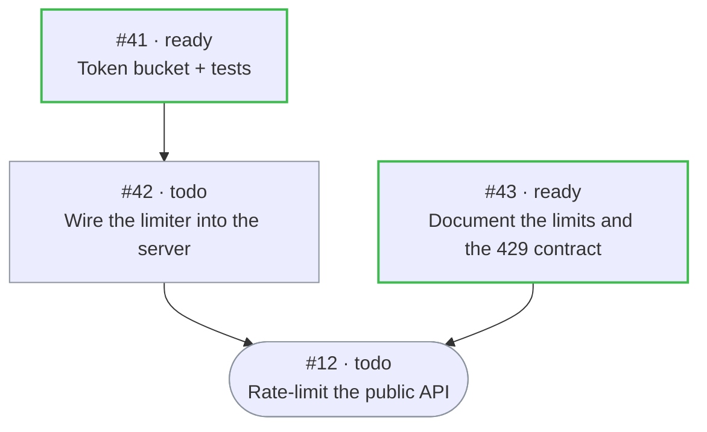

# hkb protocol v1

Everything that must survive a crash lives in GitHub. Nothing here needs a paid plan.

**Three seats**, and nothing else is a role:

- **operator** — the human. Owns the repo, the token and the scope; files and sharpens cards, steers by comment, reviews and merges, answers `kb:needs-human`.
- **dispatcher** — a tick, not an agent and not an orchestrator. Holds no workflow: it reconciles labels, locks and attempts against the graph already on the cards.
- **worker** — any harness holding one attempt on one task: Claude Code, Copilot CLI, Codex, an Actions job, or the operator running the verbs by hand.

Hand mode and autonomous mode are the same protocol with a different dispatcher — you, or the tick.

## Glossary

The three seats in full, and the words that get mistaken for seats — with what each one is *not*, which is where
the mistakes actually happen.

| Word | Is | Is not |
|---|---|---|
| **operator** | the human who owns the repo, the token and the scope: files and sharpens cards, steers by comment, reviews and merges, answers `kb:needs-human`, restarts a dispatcher that exited 4. "you", in a worker prompt | a seat an agent owns. An agent session may drive these verbs; the approvals and the credentials stay with the human |
| **dispatcher** | the tick (`hkb dispatch`): reconciles labels, locks and attempts against the graph already on the cards | an orchestrator. It holds no workflow and has no LLM in it; the graph lives on the cards as issue dependencies |
| **worker** | one session holding one attempt on one task — Claude Code, Copilot CLI, Codex, an Actions job, or the operator running the verbs by hand | a person, and not a profile — the profile only says *how* to launch one |
| *reviewer* | a **per-card gate**: `--reviewer` is **always a GitHub user**, requested on the PR — never a profile name | a seat. Nothing dispatches to a reviewer; the card sits in *review* until the PR merges |
| *track runner* | a **worker mode**: one session executing a root and everything still blocking it, node by node (see *Tracks*). Distinct from an **Actions runner**, which is a GitHub-hosted machine a worker may run on | a fourth seat, or a second protocol |
| *profile* | a **harness adapter** in `.kanban/board.json`: launch template + caps + heartbeat mode. `kb:agent:<profile>` says which one a task runs on | the model, the machine, or a person |
| *host* | **machine identity** (recorded per attempt), so the tick only checks a pid on the machine that owns it | a profile — one host runs many, one profile runs on many |
| *supervisor* | whatever restarts a dispatcher that exited 4: cron, systemd, Actions, or the operator | a judgment seat. It restarts a process; it decides nothing |

## Task = issue

| Concern | Where | Notes |
|---|---|---|
| Status | one label `kb:status:<triage\|todo\|ready\|running\|blocked\|review\|done\|archived>` | `done` = closed as completed; `archived` = closed + label |
| Board | label `kb:board:<slug>` | one issue belongs to one board; cross-board links are refused |
| Profile (assignee) | label `kb:agent:<profile>` | profile = launcher + model + caps in `.kanban/board.json` |
| Needs a human | label `kb:needs-human` | orthogonal flag; set on gave_up, block loops, most block kinds |
| Machine fields | `<!-- kb: {...} -->` block at the top of the body | `priority, workspace, max_runtime, max_retries, model, skills[], paths[], scheduled_at, idempotency_key, goal`. `priority` is a number, **higher wins**, default `0` (`--priority N`; the tick sorts *ready* by it, then oldest issue first). Band: `0` unfiled (default) · `1` normal · `2` next up · `3` urgent — see `README.md`. Malformed → defaults, never a crash |
| Dependencies | GitHub issue dependencies: child **blocked by** parent | Hermes parent→child. A blocker counts as done only when closed as *completed* |
| Attempts (Hermes `runs`) | one `<!-- kb-run -->` comment, fenced JSON | `attempts[] {attempt, profile, host, pid, started_at, heartbeat_at, lock_sha, ended_at, outcome, summary, reason, log, session_id, transcript_path, total_cost_usd, num_turns, duration_ms}`, `failures`, `block_loops`. `lock_sha` is where the lock ref started, so the worker's first CAS heartbeat knows what to lease on. The session fields are recorded once, by the Stop hook and the dispatcher: `hkb show <n>` prints them with a `claude --resume <id>` line. A track attempt also carries `track: true` and `track_nodes[]` — the subgraph it was handed, and the marker that says this root has had its one go at the fast engine. An attempt from a `"mode": "trigger"` profile (`claude-action`) carries `remote: true`: the launch only *started* work elsewhere, so there is no pid or job anywhere to look at. An attempt from `hkb claim <n>` with no `--spawn` carries `manual: true` — the operator claimed it and is working it in their own terminal, so there is no pid either; both are judged by the heartbeat alone. An attempt the dispatcher started to **continue** a PR the reviewer sent back carries `continues_pr: <number>`, and `continues_branch: <head branch>` when the dispatcher managed to put the checkout on that branch, and `continues_branch_stale: <why>` when that checkout could not be fast-forwarded to the remote head (the brief then says how to catch it up) (without it, the brief is what tells the worker which PR to push to). `profile` is normally a board profile, but three values are **reserved and synthetic** (the row also carries `synthetic: true`, and opens and closes in the same instant): `dispatcher` — the tick wrote the row itself, out of retries (`gave_up`); `reviewer` — `hkb request-changes` sent the card back (`changes_requested`); `human` — the operator ran a terminal verb by hand on a task with no open attempt and no `kb:agent:*` label. Do not name a board profile after one of them |
| Structured handoff | `<!-- kb-result -->` comment per completion / review request | `{summary, metadata{changed_files, verification, dependencies, residual_risk, retry_notes}, artifacts[]}` |
| Events | issue timeline + attempt rows (`hkb log`) | |
| Claim | git ref `refs/kb/locks/<n>/<attempt>` | create = atomic claim (201 claimed / held on **422 "Reference already exists"** — the observed duplicate response, verified 2026-08-26 — or 409 / anything else unknown → back off) |
| Heartbeat | the same ref, advanced by CAS | `git push origin <new>:<ref> --force-with-lease=<ref>:<expected>`; rejected lease = `LOCK_LOST` (exit 3). See below |
| Output | branch + draft PR with `Closes #n` | PR merge closes the issue; an open PR moves the task to `review` |
| Merging | the operator, or GitHub's auto-merge — never hkb, never a worker | `dispatch.merge.mode` in `.kanban/board.json`: `manual` (default) leaves the last step to the human; `auto` has the **dispatcher** enable GitHub's auto-merge on the card's PR once, at review time. Board policy, because a rote click on one repo is the one gate worth keeping on another. `hkb doctor` refuses `auto` on a base branch that requires no status check and no approving review — auto-merge there lands the PR the moment it opens |

Precedence when they disagree: run comment > labels > body block.

## State machine

```
triage  --(human / hkb promote)-------------------------------→ todo
todo    --(all blockers closed-as-completed AND scheduled_at <= now)--→ ready       [dispatcher, every tick]
ready   --(claim ref created)----------------------------------→ running
running --complete--→ done (issue closed)   | --block(kind)--→ blocked (or todo if kind=dependency)
running --request-review--→ review          | --crash/timeout/stale/protocol_violation--→ ready (failures++)
failures > max_retries -----------------------------------------→ blocked + kb:needs-human (gave_up)
review  --PR merged / reviewer complete--→ done | --request-changes--→ ready (same PR, same branch)
blocked --unblock / promote--→ ready (or todo if blockers open)
same block reason × block_recurrence_limit ---------------------→ triage + kb:needs-human
done    --archive--→ archived
```

`ready` derives **only** from blocker closure. PR state never gates readiness — it gates *claiming*:
the `active_pr` guard parks a `ready` card whose PR is open in `review`, because a card waiting on a
human must not be redone by a second worker. The one exemption is the card `hkb request-changes`
produces. Its latest attempt is the reviewer's synthetic `changes_requested` row, which *means* "the
PR is open and must be continued", so the card stays claimable and the next attempt continues that
PR — on its head branch, with `continues_pr` on the attempt row — instead of opening a second one.
Only the latest row exempts: a continuation that crashes leaves `crashed` on top and the guard parks
the card again, so one `request-changes` buys exactly one relaunch.

### The review loop, in full

```
worker --request-review--→ review  ──reviewer: hkb request-changes <n> "why"──→  ready
   ▲                                                                              │
   └── hkb finish (open PR → review, same PR) ←── attempt k+1, on the PR's branch ─┘
```

`hkb request-changes` leaves the PR exactly as it is — open, draft or not: it is the continuation
target, and closing it would throw away the branch the next attempt needs. What the reviewer writes
reaches that attempt twice: as the `changes_requested` row in *Prior attempts*, and as the block at
the top of the brief that names the PR, its branch, and the one rule — **do not open a second PR**.

Where the checkout comes from is the dispatcher's problem, not the worker's. It makes
`.claude/worktrees/kb-<n>-<k>` on the PR's head branch itself (fetching it first, and freeing it from
the ended attempt's checkout if that still holds it), and drops the harness's own worktree flag so
there is one checkout, not two. When it cannot — the branch is held by a live session, there is no
remote — the attempt still runs, on an ordinary fresh worktree, and the brief carries the recipe
(`git fetch origin <branch> && git reset --hard FETCH_HEAD`, then `git push origin HEAD:<branch>`).
Either way the worker merges the base branch in rather than rebasing: **never `git push --force`.**

## Heartbeat

A heartbeat says "this attempt is still alive". Two ways to say it, chosen by the profile's `heartbeat` field
in `.kanban/board.json` — `auto` (the default: ref, falling back to comment), `ref`, or `comment`.

**ref (compare-and-swap, the default).** `hkb heartbeat <n>` advances the attempt's own lock ref from the worker's
worktree:

```bash
new=$(git commit-tree <tree of expected> -p <expected> -m "hkb heartbeat #<n> attempt <k>")   # an empty commit
git push origin $new:refs/kb/locks/<n>/<k> --force-with-lease=refs/kb/locks/<n>/<k>:<expected>
```

- `<expected>` is **this worker's own record** of where it left the ref — the local mirror of the ref, falling back
  to the attempt's `lock_sha`. Never a fresh read of the ref: leasing on whatever it says right now would stomp
  whoever holds it.
- The lease *is* the check. It holds only while the ref is exactly where this attempt left it, so a reclaim (which
  deletes the ref) rejects the push atomically. A deleted ref and a moved one both come back as
  `! [rejected] … (stale info)` — verified against git 2026-08-26.
- A rejected lease is verified once against `GET git/ref/kb/locks/<n>/<k>`: **gone → `LOCK_LOST`, exit 3**; still
  ours → the local chain drifted (a push landed, its `update-ref` did not), so resync and beat again.
- Cost: zero API calls on the warm path — no task read, no run-record read, no write. The git transport is not the
  REST content budget. Only a rejected lease or a fallback costs a request.
- Any other git failure (no remote, no credentials, offline) is *not* a LOCK_LOST: `hkb` says so on stderr and
  records the beat in the run comment instead. Only a rejected lease may stop a worker.

**comment (fallback).** A write to the `<!-- kb-run -->` record, floored at 10 minutes, preceded by an
authoritative `GET` of the lock ref (404 → `LOCK_LOST`). For workers that cannot push arbitrary refs (cloud tiers);
the dispatcher owns their lock. `hkb heartbeat <n> --note "..."` always takes this path — a note is content.

## Dispatcher tick (`hkb dispatch`)

1. Replay `.kanban/outbox.jsonl` (writes queued while GitHub was unreachable).
2. For every `running` task: crashed (pid gone on this host) · timed_out (`max_runtime`) · reclaimed (no signal for `stale_after`) → close the attempt, release the ref, `failures++`, back to `ready` or `gave_up`. The last signal is the freshest of `started_at`, `heartbeat_at` and **the committer date of the commit the lock ref points at** — the only trace a CAS heartbeat leaves. That commit is read only for an attempt that already looks stale, so a live board costs one extra request per reclaim decision and a quiet one costs none. A `remote` or `manual` attempt skips every local check — `max_runtime` and the heartbeat are the whole of it. That is what makes claiming by hand safe: the dispatcher never mistakes a pidless attempt for a crashed spawn, but it does reclaim one that stops beating for `stale_after` (1h by default). This same pass notes, for every attempt that survives it, whether the attempt has gone **idle** — for a `claude-bg` attempt, its job record's own liveness settles it (a live job holds no matter how old its heartbeat looks, since the default ref-CAS heartbeat never touches the run comment at all); a `process` attempt's live pid is just as authoritative, for the same reason (`process.kill(pid, 0)`, free); anything else — `manual`, `remote`, or a `claude-bg` job on another host — falls back to no heartbeat for longer than the idle threshold (the tick interval or 20 minutes, whichever is larger — a plain heartbeat floors at 10 minutes, so the threshold gives it two beats' grace before calling it quiet), refreshed by the same lock-ref beat read the reclaim check above uses, just at this lower threshold instead of `stale_after` — so `path_overlap` (below) never holds a card's paths behind a session that stopped making progress without crashing.
3. Sweep orphan lock refs (no matching open attempt).
4. Promote `todo` → `ready`.
5. Track roots first (see *Tracks* below): a root on a profile with `"track": true` whose whole subgraph is claimable takes the same caps and guards — with the union of its nodes' `kb.paths` — and spawns **one** session for all of it. Then `ready` tasks by priority: caps (`max_in_progress`, per-profile, daily spawn cap) → guards (`active_pr` → review *unless the latest attempt is `changes_requested`*, in which case the card is claimed and the attempt **continues that PR**; `blocker_auth` pause; `recent_success`; `path_overlap`) → claim ref → append attempt → label `running` → spawn the profile's launch command with `KB_*` env. A node a live track owns is skipped here and costs no slot. `hkb dispatch --profiles a,b` restricts *this step only* to profiles the host can launch — how the Actions dispatcher takes the `claude-action` tasks and leaves a laptop's `claude` ones alone; every other step still covers the whole board.
6. On a board with `"merge": {"mode": "auto"}`: for every card now in `review` with an open, non-draft PR that has no auto-merge request yet, one `enablePullRequestAutoMerge` — GitHub merges it when *its* gates go green. Nothing to poll and nothing to retry: a PR whose checks fail simply never merges. Refused, with the fix, on a base branch that requires nothing.
7. Mirror the labels onto the linked Projects v2 board, when there is one (see below).

One GraphQL query per board per tick; everything else is per-task and only for tasks that changed state.

### `path_overlap` guard — three modes

The guard exists to avoid the *merge* conflict when two open PRs touch the same files, never the working-copy
conflict — every worker already runs in its own worktree. `dispatch.guards.path_overlap` in `.kanban/board.json`
picks which cards count as "still in the way" of a candidate whose `kb.paths` overlap theirs:

| mode | holds a card's paths while it is... | earns its keep when |
|---|---|---|
| `"off"` | nothing — the guard never fires | `merge.mode` is `"manual"` (**the default**): the first card's PR then waits on a human, so "another card is running" does not approximate "not merged yet" — it never did, and serialising on it just spends parallelism for nothing. |
| `"running"` | `running` | a board that wants today's (pre-#185) behaviour back — kept for that, not removed. |
| `"unmerged"` | `running` **or** `review` with an open PR | `merge.mode` is `"auto"` (**the default there**): `review → merged` is immediate, so "not merged yet" is exactly `running` or `review`. |

The effective mode, when `dispatch.guards.path_overlap` is unset, follows `merge.mode`: `"off"` for `"manual"`,
`"unmerged"` for `"auto"`. Any other `merge.mode` — including `"operator"` (#189) — defaults to `"off"` too: it is
not `"auto"`, so the guard's premise that "running approximates merged" still does not hold. Set it explicitly to
override either default. The older `dispatch.path_guard: true|false`
still works for a board that set it before this existed (`true` → `"running"`, `false` → `"off"`); an explicit
`dispatch.guards.path_overlap` always wins over it. `hkb doctor` prints the effective mode and why.

Whatever the mode, a card never holds its paths behind an **idle** attempt — one whose session has stopped making
progress without crashing (see step 2 above): a slow human reviewer is expected friction, a stuck agent session
is not, and the difference is not a MERGE_MODE thing. A guard hit — `--dry-run`, or the tick log — names the card
and the paths it collides with, not just `guarded: path_overlap` (#176).

## Decomposition, worked

A goal issue is split by `/kanban:decompose` (a slash command that `hkb init` and the `kanban` plugin both register;
its body sends you to the section of `SKILL.md` with the same name). It runs in a human's session — the dispatcher
never decomposes anything, and there is no `hkb decompose`. The shape is Hermes': children carry the work, and the **root is blocked by its leaves**, so it
becomes ready again for a final verify pass once the tree is done.

Goal `#12 Rate-limit the public API`, in *triage*, split into three children:

```
        #41 token bucket ──▶ #42 wire it into the server ──┐
                                                           ├──▶ #12 (root: verify + synthesize)
        #43 document the limits and the 429 contract ──────┘
```

The shared decision — `takeToken(key, now)` returns `{ok, retryAfterMs}`, and a refusal is `429` with `Retry-After` in
seconds — is written out in **all three** child bodies: #41 implements it, #42 consumes it, #43 documents it, and none
of them can see the others.

```bash
hkb create "Token bucket + tests" --priority 2 --paths src/limit.js,test/limit.test.js --body "$(cat a.md)"     # → #41 ready
hkb create "Wire the limiter into the server" --blocked-by 41 --priority 2 --paths src/server.js --body "$(cat b.md)"  # → #42 todo
hkb create "Document the limits and the 429 contract" --priority 1 --paths docs/,README.md --body "$(cat c.md)" # → #43 ready
hkb link 42 12 && hkb link 43 12    # the leaves; #12 is now blocked by both
hkb promote 12                      # triage → todo (link first: promote on a todo task forces ready)
hkb graph 12 >> graph.md            # the picture of what you just built (below)
hkb comment 12 "$(cat graph.md)"
```

```
TODO
  #12    todo     claude     p2  Rate-limit the public API ⇐ #42,#43
  #42    todo     claude     p2  Wire the limiter into the server ⇐ #41

READY
  #41    ready    claude     p2  Token bucket + tests
  #43    ready    claude     p1  Document the limits and the 429 contract
```

Tick 1 claims **#41 and #43** together — their `paths` are disjoint, so `path_overlap` lets both run (default
`max_in_progress` is 2). When #41's PR merges the issue closes as completed and the next tick promotes #42. When #42
and #43 have both closed, #12 becomes ready and its worker gets the two leaf summaries under *Parent task results* —
only its own blockers, so #41's result is one `hkb show 41` away.

A materialized graph is valid when:

1. every `blocked by` number exists and carries the same `kb:board:*` label — cross-board links are refused;
2. the edges are acyclic, and **no child is blocked by the root** (that cycle starves the whole tree);
3. the root is blocked by exactly the leaves — the children nothing else depends on;
4. children were created parents-first, so each `--blocked-by` number already existed;
5. siblings meant to run at once have non-overlapping `paths` — prefixes count (`src/` overlaps `src/limit.js`), and an
   empty `paths` is neither guarded nor guards anyone, so two path-less children can edit the same file at once;
6. every decision two children share is written into both bodies.

### The graph as a diagram — `hkb graph <n>`

`hkb graph <n> [--mermaid]` prints the **track** rooted at `<n>` — the root plus everything still blocking it,
the same subgraph `resolveTrack` gives the dispatcher — as one fenced mermaid block. GitHub renders mermaid in
issues, comments, PRs and markdown files, so the picture goes where the tasks already are; `--mermaid` is the
explicit spelling of what the command does anyway. `--json` returns `{ root, nodes, edges, cycle, mermaid }`.

For the board above, `hkb graph 12` emits (and this is that block, rendered):



- Arrows point the way work flows — blocker → what it unblocks — so the frontier is at the top and the root is
  the stadium at the bottom. A blocker closed as *completed* is finished work, so it is not drawn: the diagram
  shrinks with the track. One that is unfinished but **not on this board** is drawn dashed as `not on this
  board`, because a hole in a graph has to be visible.
- Labels are entity-escaped: `#` → `#35;` (a raw `#123` renders as one wrong glyph, and it is not a parse
  error, so it fails silently), `"` → `#quot;`, `<`/`>` → `#60;`/`#62;` (labels are HTML, so `<n>` would be
  swallowed as a tag). Titles are clipped at 56 characters.
- `classDef`s set a **stroke** and nothing else. GitHub renders mermaid with a dark theme for dark-mode readers
  and a light one for everyone else; pinning `fill` or `color` makes the labels unreadable in one of the two.

## Tracks — the second execution engine

A **track** is a view, not a new object: a root task plus every task that is still blocking it, transitively. The same
issues, the same labels, the same verbs. What changes is who runs them.

| | node dispatch (default) | track runner |
|---|---|---|
| Granularity | one cold session per node | one session for the whole subgraph — an **orchestrator**, one isolated subagent per node |
| Selected by | any `ready` task | a root with unfinished children, by default (`isTrackRoot`) — or any card whose own profile has `"track": true` |
| Lock claimed by the dispatcher | the task's | the **root's** only |
| Node locks | — | claimed by the runner, a **wave** at a time, as it reaches each wave |
| Heartbeat | the task's own lock ref | the **root's** lock ref covers every node under it |
| `max_in_progress` | one slot per task | one slot per track, however many nodes it holds |
| `path_overlap` | the task's `kb.paths` | the union of every node's `kb.paths` |
| Between two dependent nodes | a tick of latency, and the context re-derived | in the same session, in memory |
| Two independent nodes | both, if there are slots for both | both, inside the one slot |

Everything else is deliberately identical, and that is the whole safety argument: **every node still goes through its
own terminal verb**, so every node is a durable checkpoint. A runner that dies mid-track leaves a board with per-node
truth on it, and the ordinary tick finishes the rest node by node — no new crash semantics, no new recovery path.

### One orchestrator, one subagent per node

A track runner does not do the nodes itself. It walks `trackWaves` — the track split so that nothing in a wave
depends on anything else in it — and for each wave it claims the nodes, hands **each one to its own isolated
subagent**, collects them, and only then starts the next wave. Siblings therefore run at the same time, and a
seven-node track no longer carries seven nodes' context in one window.

- **The `Agent` tool is the whole unlock.** A worker launches with `--permission-mode dontAsk`, which *denies* a
  tool that is not on `--allowedTools` rather than prompting, so `Agent` is on the `claude-track` allow-list and on
  no other shipped profile. `trackFanout(cfg, profile)` reads that list, and it is what picks which brief the runner
  gets: without `Agent`, the older node-after-node brief, which is always a correct way to run a track. Cold node
  workers stay single-agent on purpose — a node worker that could fan out would spawn children nothing has claimed.
- **`isolation: "worktree"`.** Two agents cannot share a checkout, so each subagent gets its own — a repo-level
  `.claude/worktrees/agent-<id>`, named by the harness and **auto-removed when the subagent returns**. That is why
  the per-node brief says *commit and push before you return*: anything unpushed goes with the worktree.
- **Disjoint `kb.paths` are what make a wave safe**, and `/kanban:decompose` already enforces them. The rule that
  lets the dispatcher run two nodes side by side is the same rule that lets one wave run side by side.
- **The subagent shares the root's session.** Measured (Claude Code 2.1.251, #129): inside a child,
  `CLAUDE_CODE_SESSION_ID` and `CLAUDE_JOB_DIR` are the root's, so a node finished from a subagent records the
  runner's session id and the track is still counted once (see `docs/harnesses.md`). The launch's hooks fire inside
  children too, `PreToolUse` included, so the permission policy holds all the way down.
- **The orchestrator verifies the verb, because nothing else will.** The Stop nudge keys on `KB_TASK`, which is the
  root — it never fires for a child. So after every wave the runner reads `hkb show <n> --json` per node and, for a
  node its subagent left `running`, files the verb itself or blocks it. That check is brief-level, not enforced code:
  a node left `running` is exactly what the ordinary dispatcher reclaims after `stale_after` anyway.
- **A wave is not all-or-nothing.** One subagent blocking parks its dependents transitively; its siblings still
  finish and still count — the same skip-on-block semantics the sequential brief had.
- **The root is the one node the orchestrator does itself**: the integration pass, on top of the nodes' branches,
  by the only participant that has read every subagent's report.

The envelope is sized for that: `claude-track` launches with `--max-turns 400 --max-budget-usd 50`. Whether
`--max-budget-usd` counts subagent tokens was not measurable without exceeding it, so the budget is set as if it
does, and `hkb stats` under-reports a fanned-out track — a subagent's usage goes to a sidecar transcript the stats
reader does not open (#155).

The dispatcher recognises a track root in step 5 of the tick, before it selects ready tasks:

1. resolve the subgraph — the root plus its unfinished blockers, transitively. A blocker closed as *completed* is
   finished work, not a node, so a track shrinks as it runs and a resumed track is exactly what is left.
2. refuse, and fall back to node dispatch, on anything unusual — a cycle · a blocker not on this board · a node that
   is `running`, `blocked`, `review` or `triage` · a node wearing `kb:needs-human` · a node with an open PR · a node
   on a profile outside the runner's `track_agents` (**cross-harness tracks are out of scope**: one session is one
   harness) · a root that has already had one track attempt. Every refusal is reported, none is an error.
3. claim the root's lock, append an attempt carrying `track: true` and `track_nodes: [...]`, label the root
   `kb:status:running`, and spawn one session with the track prompt.
4. while that attempt is open, the nodes are *covered*: the tick will not reclaim them (they have no pid of their
   own — the root's lease is their liveness), will not claim them, and does not count their slots.

The runner's contract is in `SKILL.md` under *When you run a track*, and the node contract inside it is the ordinary
worker one: `hkb context <n>` → `hkb claim <n>` → work on a branch of its own (`git switch -c kb/<n> <base>`, where
`<base>` is the blocker's branch) → one draft PR with exactly one `Closes #<n>` → one terminal verb, per node, then
the root last. One PR per node is what keeps a node a checkpoint: its issue closes when *its* PR merges. A single PR
closing several nodes would park the unfinished ones in *review* behind it, where nothing could finish them.

**When to prefer a track.** A track used to be the slower-but-cheaper engine: it saved a tick of latency per edge and
one slot, and gave up the parallelism node dispatch had. It no longer gives that up. Prefer a track when the graph is
one goal's — the nodes share a design decision the orchestrator should hold in one head, and the branches stack. Prefer
node dispatch when the tasks are unrelated, when they span harnesses (`track_agents`), or when you want each one
judged on its own attempt history. A track is also the only way to run a subgraph wider than `max_in_progress`: its
wave costs one slot however wide it is.

Which is what the dispatcher assumes: a card with unfinished children that nothing else is still blocked by is a
track, on the board's track profile, with no adopt step (`isTrackRoot`, src/model.js). The `kb:agent:*` label is the
override in both directions and stays on the card either way — it is what node dispatch reads on every fallback.

```bash
hkb track 12                                      # → #12 track: inferred — 3 unfinished children; one claude-track …
hkb dispatch --dry-run                            # → #12: [dry-run] would run track #41 → #42 → #43 → #12
hkb track 12 --off                                # kb:no-track: run the children as cold nodes after all
hkb adopt 12 --agent claude-track --status todo   # the other way: force a track the graph would not infer
```

## Projects v2 mirror (optional)

`.kanban/board.json` may carry a `"project"` block (`hkb init --project <number|new>`; needs `gh auth refresh -s project`):

```json
"project": { "number": 7, "id": "PVT_…", "url": "…", "owner": "me",
             "status_field_id": "PVTSSF_…", "status_field_name": "Status",
             "options": { "triage": "…", "todo": "…", "…": "…" } }
```

The mirror is **one-way**: a `kb:status:*` label is the truth and the Project item's Status field is a copy of it. The
dispatcher writes it at the end of the tick, from the labels it has just set — so a card dragged in the Project UI
changes nothing on the board and is moved back on the next tick. An item whose issue is not on this board is never
touched. Cost while it is on: one read of the project's items per tick, one mutation per transition (two on an issue's
first touch, which adds it to the project), capped at 25 new items per tick. A deleted project, or a token without the
`project` scope, is reported (once an hour in the loop, always in `hkb doctor` and in `dispatch --json`) and skipped;
nothing else about the board changes.

## Worker environment

`KB_TASK` `KB_ATTEMPT` `KB_BOARD` `KB_REPO` `KB_LOCK_REF` `KB_ROOT` `KB_PROFILE`

`KB_ATTEMPT` belongs to `KB_TASK` and is read only for it. A plain worker only ever acts on its own task, so this is
invisible — but a track runner claims and finishes several tasks from one session, and each has its own attempt
numbering. Any verb it runs on another task resolves that task's own open attempt.

## Terminal verb inputs

`complete`, `block` and `request-review` take their payload from any of three sources, so no harness has to push JSON
through shell quoting. Per field, inline > file > stdin.

| Source | Form |
|---|---|
| stdin (**recommended**) | `--from-stdin` + one JSON object `{summary, metadata, artifacts, reason, kind, reviewer}`; unknown keys are refused |
| files | `--summary-file <path>` `--metadata-file <path.json>` `--reason-file <path>`; `--metadata <path>` reads a file when the value does not start with `{` |
| inline | `--summary ".." --metadata '{..}' --artifacts a,b` · `block <n> "reason" --kind <kind>` · `--reviewer <github-user>` |

```bash
hkb finish "$KB_TASK" --from-stdin < /tmp/kb-payload.json
```

### `finish`, and a redirect rather than a heredoc

`finish` is an alias for `complete`, and it is the spelling a worker should be given. `complete` is a **bash
builtin** (`complete -C <cmd>` runs a string through a shell), so a harness that vets a worker's command line word
by word sees the builtin, not hkb's verb. Claude Code does: inside a worktree-isolated session — every `claude
--bg` worker — `hkb complete <n>` is refused with *"this command runs a string through complete, which can't be
verified to stay inside the worktree"*, for any arguments and any quoting, and a `<<'EOF'` heredoc is refused
there as well (*"Permission to use Bash has been denied because Claude Code is running in don't ask mode"*),
whatever its body contains. `block` and `request-review` are not builtins and need no alias.

So the portable form of a terminal verb is: **write the JSON to a file, redirect it, and say `finish`.** The alias
is resolved before routing, so the run record, the outbox replay and the board still say `complete`.

`metadata` must be a JSON object (`changed_files, verification, dependencies, residual_risk, retry_notes` by convention);
`artifacts` a list of strings. Missing summary / reason → exit 2 with the fix in the message. A verb queued in the
outbox while GitHub is unreachable is stored in its inline form, so replay needs neither stdin nor the worker's files.

## Outcomes

`completed · blocked · crashed · timed_out · spawn_failed · reclaimed · protocol_violation · gave_up · review_requested · changes_requested`

## Exit codes

`0` ok · `1` error · `2` usage / wrong state · `3` LOCK_LOST (stop immediately) · `4` the dispatcher loop gave itself
up — its self-heal ladder ran out, so it died with a reason instead of ticking on. Only `hkb dispatch --loop` ever
exits 4, and only a **supervisor** (cron, systemd, Actions) or the operator starts a fresh one. A worker never sees it.
